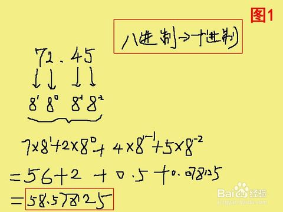

JavaScript

  JavaScript是一种运行在***客户端*** 的***脚本语言*** 

  JavaScript的解释器被称为JavaScript引擎，为浏览器的一部分，广泛用于客户端的脚本语言，最早是在HTML（标准通用标记语言下的一个应用）网页上使用，用来给HTML网页增加动态功能。

## 执行环境

  执行环境：在宿主环境（host environment）下运行，浏览器是最常见的 JavaScript 宿主环境

- 但是在很多非浏览器环境中也使用 JavaScript ，例如 node.js

## JavaScript的组成

 

| 组成部分   | 说明                               |
| ---------- | ---------------------------------- |
| Ecmascript | 描述了该语言的语法和基本对象       |
| DOM        | 描述了处理网页内容的方法和接口     |
| BOM        | 描述了与浏览器进行交互的方法和接口 |

### ECMAScript - JavaScript的核心

​    JavaScript的核心，描述了语言的基本语法和数据类型，ECMAScript是一套标准，定义了一种语言的标准，与具体实现无关

### DOM - 文档对象模型

​    一套操作页面元素的API

​    DOM可以把HTML看做是文档树，通过DOM提供的API可以对树上的节点进行操作

### BOM - 浏览器对象模型

​    一套操作浏览器功能的API

​    通过BOM可以操作浏览器窗口，比如：弹出框、控制浏览器跳转、获取分辨率等

## JavaScript的书写方式

 1、写在行内

```javascript
<input type="button" value="按钮" onclick="alert('Hello World')" />
```

 2、写在script标签中

```javascript
<head>
  <script>
    alert('Hello World!');
  </script>
</head>
```

 3、写在外部js文件中，在页面引入

```javascript
<script src="main.js"></script>
```

# 计算机组成

##  硬件

-  三大件：CPU、内存、硬盘    
- 主板输入设备：鼠标、键盘、手写板、摄像头等
- 输出设备：显示器、打印机、投影仪等

##  软件

- 应用软件：浏览器(Chrome/IE/Firefox)、QQ、Sublime、Word
- 系统软件：Windows、Linux、mac OSX

# 变量

-  什么是变量？

​          变量是计算机内存中存储数据的标识符，根据变量名称可以获取到内存中存储的数据

- 为什么要使用变量

​         使用变量可以方便的获取或者修改内存中的数据

###   var声明变量

```javascript
var age;

var age, name, sex;
name = "boy";

var age = 10, name = 'zs';
```

###   变量在内存中的存储

   

###   变量的命名规则和规范

#####     规则

-  由字母、数字、下划线、$符号组成，不能以数字开头
-  不能是关键字和保留字，例如：for、while。
-  区分大小写

#####     规范

-  变量名必须有意义
-  遵守驼峰命名法。首字母小写，后面单词的首字母需要大写。例如：userName、userPassword


# 字面量

​      literal

​    在源代码中一个固定值的表示方式

- 数字字面量   （number literal）

​             8, 9, 10

- 字符串字面量  （string literal）

​             '程序员', "大前端"

-  布尔字面量  （boolean literal）

  ​      true，false

- 数组字面量    (array literal)
- 对象字面量    (object literal)
- 函数字面量    (function literal)

  注：  基本类型变量（没有使用new创建的变量）严格等于字面值，对象实例则不会。

　　　基本类型是根据值来进行比较的，而值是字面值。

# 数据类型

##   简单数据类型（值类型）

​    Number、String、Boolean、Undefined、Null

###     Number 类型

- 数值字面量：数值的固定值的表示法

  ​    110        1024      60.5

- 进制

```
    十进制
        var num = 9;
        算数计算时，八进制和十六进制表示的数值最终都将被转换成十进制数值。

    十六进制
        var num = 0xA;   （以0X或0x开头）
        数字序列范围：0~9以及A~F
        0x1315 、 0x13F 
          0x1315表示的十进制数为 5*1+1*16+3*16*16+1*16*16*16 = 4885
          0x13F表示的十进制数是 15*1+3*16+1*16*16 = 319

    八进制    （以0开头）
        var num1 = 07;   // 对应十进制的7
        var num2 = 019;  // 对应十进制的19
        var num3 = 08;   // 对应十进制的8
        数字序列范围：0~7
        如果字面值中的数值超出了范围，那么前导零将被忽略，后面的数值将被当作十进制数值解析 
```

​              八进制如何转换成十进

​                    

- 浮点数

```
    var n = 5e-324;   // 科学计数法  5乘以10的-324次方  
      浮点数值的最高精度是 17 位小数，但在进行算术计算时其精确度远远不如整数
       var result = 0.1 + 0.2;
       console.log(result)   // 结果不是 0.3，而是：0.30000000000000004
       console.log(0.07 * 100);    // 7.000000000000001
       不要判断两个浮点数是否相等
```

- 数值范围

```
    最小值：Number.MIN_VALUE，这个值为： 5e-324
    最大值：Number.MAX_VALUE，这个值为： 1.7976931348623157e+308
    无穷大：Infinity
    无穷小：-Infinity
```

- 数值判断

```
     NaN：not a number
      - NaN 与任何值都不相等，包括他本身
           100 - '2a' ; // NaN
           '100' / '20a'; // NaN
   
     isNaN( )
         用来确定一个值是否为NaN，  返回值为NaN则返回值为true，否则为false
         
        var number = 100 - '2a';
        var fale = isNaN(number);
        console.log(fale);   //true
```

- 转换成数值类型

  - Number()

    ```
    可以把任意值转换成数值，如果要转换的字符串中有一个不是数值的字符，返回NaN
    
    var num = "122";
    console.log(Number(num));   // 122
    
    var str = "122abc";
    console.log(Number(str));   // NaN
    ```

  - parseInt()

    ```
    var num1 = "12.3abc";
    parseInt(str_1);       // 返回12，如果第一个字符是数字会解析，直到遇到非数字结束，并返回一                         个整数(直接舍去小数部分)
    var str_2 = "abc123"
    parseInt(str_2);       // 返回NaN，如果第一个字符不是数字或者符号就返回NaN
    ```

  - parseFloat()

    ```
     该方法指定字符串中的首个字符是否是数字。如果是，则对字符串进行解析，直到到达数字的末端为止，然后返回该数字，而不是作为字符串
    
    var str_1 = "12.7abc";
    console.log(parseFloat(str_1));   // 12.7
    ```

  - +，-0等运算

    ```
    var str = '500';
    console.log(+str);		// 500  取正
    console.log(-str);		// -500 取负
    console.log(str - 0);   // 500
    ```

###   String 类型

- 字符串字面量

​            "程序猿"   "abc"

- 转义符

​          

- 字符串长度

​        length属性用来获取字符串的长度

```
    var str = '程序猿 Hello World 233';
    console.log(str.length);  // 19
```

- 字符串拼接

​        字符串拼接使用 + 连接

```
    console.log(11 + 11);              // 22
    console.log('hello' + ' world');   // 'hello word'
    console.log('100' + '100');        // '100100'
    console.log('11' + 11);            // '1111'  
    console.log('male:' + true);       // 'male:true'
```

​       总结：  1、两边只要有一个是字符串，那么+就是字符串拼接功能

​                    2、两边如果都是数字，那么就是算术功能。

- 转换成字符串类型

  - toString()

    ```
    var num = 5;
    console.log(num.toString());    // '5'
    ```

  - String()

    ```
    String()函数存在的意义：有些值没有toString()，这个时候可以使用String()。比如：undefined和                     null
    
    var num;
    console.log(String(num));  // "undefined"
    ```

  - 拼接字符串方式

    ​     当 + 两边一个操作符是字符串类型，一个操作符是其它类型的时候，会先把其它类型转换成字符串再进行字符串拼接，最后返回字符串 

###   Boolean 类型

- Boolean字面量：  true和false，区分大小写

- 计算机内部存储：true为1，false为0

- 转换成布尔类型

  - Boolean()

    ```
      0  -0  ""(空字符串)  null  undefined  NaN  false 会转换成false,  其它都会转换成true(包括”false")
    ```

###   Undefined 类型

​    表示一个声明了没有赋值的变量，变量只声明没有赋值时的值默认是undefined

###   Null 类型

​    表示一个空，变量的值如果想为null，必须手动设置

##  复杂数据类型（引用类型）

- Object
- Array
- Date
- RegExp
- Function
- 基本包装类型
  - Boolean
  - Number
  - String
- 单体内置对象
  - Global
  - Math

## 获取变量的类型(类型检测)

- typeof
- instanceof
- Object.prototype.toString.call()

```
var age = 18;
console.log(typeof age);  // 'number'
```


# 数组

###  为什么要学习数组

​    之前学习的数据类型，只能存储一个值(比如：Number/String。我们想存储班级中所有学生的姓名，此时该如何存储？

### 数组的概念

​    所谓数组，就是将多个元素（通常是同一类型）按一定顺序排列放到一个集合中，那么这个集合我们就称之为数组。

### 数组的定义

​    数组是一个有序的列表，可以在数组中存放任意的数据，并且数组的长度可以动态的调整


# 作用域

  作用域：变量可以起作用的范围

## 全局变量和局部变量

- 全局变量

  在任何地方都可以访问到的变量就是全局变量，对应全局作用域

- 局部变量

  只在固定的代码片段内可访问到的变量，最常见的例如函数内部。对应局部作用域(函数作用域)

## 块级作用域

​    任何一对花括号（｛和｝）中的语句集都属于一个块，在这之中定义的所有变量在代码块外都是不可见的，我们称之为块级作用域。

   注意： 在es5之前没有块级作用域的的概念，只有函数作用域


# Web API

###  API的概念

   API（Application Programming Interface,应用程序编程接口）是一些预先定义的函数，目的是提供应用程序与开发人员基于某软件或硬件得以访问一组例程的能力，而又无需访问源码，或理解内部工作机制的细节。

- 任何开发语言都有自己的API
- API的特征输入和输出(I/O)
- API的使用方法(console.log())

### Web API的概念

  浏览器提供的一套操作浏览器功能和页面元素的API(DOM和BOM)

  此处的Web API特指浏览器提供的API(一组方法)，Web API在后面有其它含义

# DOM

### DOM的概念

  文档对象模型（Document Object Model，简称DOM），  又称为文档树模型

​    

- 文档：一个网页可以称为文档
- 节点：网页中的所有内容都是节点（标签、属性、文本、注释等）
- 元素：网页中的标签
- 属性：标签的属性

模拟文档树结构

​    


### DOM经常进行的操作

- 获取元素
- 动态创建元素
- 对元素进行操作(设置其属性或调用其方法)
- 事件(什么时机做相应的操作)

## 获取页面元素

###  为什么要获取页面元素

   要操作页面上的某部分(显示/隐藏，动画)，需要先获取到该部分对应的元素，才进行后续操作

###  根据id获取元素

```
var div = document.getElementById('main');
console.log(div);

// 获取到的数据类型 HTMLDivElement，对象都是有类型的
// HTMLDivElement <-- HTMLElement <-- Element  <-- Node  <-- EventTarget
```


# BOM

### BOM的概念

​    BOM(Browser Object Model) 是指浏览器对象模型，浏览器对象模型提供了独立于内容的、可以与浏览器窗口进行互动的对象结构。BOM由多个对象组成，其中代表浏览器窗口的Window对象是BOM的顶层对象，其他对象都是该对象的子对象。

​    我们在浏览器中的一些操作都可以使用BOM的方式进行编程处理，比如：刷新浏览器、后退、前进、在浏览器中输入URL等

### BOM的顶级对象window

​    window是浏览器的顶级对象，当调用window下的属性和方法时，可以省略window

​    注意：window下一个特殊的属性 window.name

## 对话框

- alert()
- prompt()
- confirm()

## 页面加载事件

- onload

```
window.onload = function () {
  // 当页面完全加载所有内容（包括图像、脚本文件、CSS 文件等）执行
}
```

- onunload

```
window.onunload = function () {
  // 当用户退出页面时执行
}
```

## 定时器

### setTimeout() 和 clearTimeout()

​    在指定的毫秒数到达之后执行指定的函数，只执行一次

```
// 创建一个定时器，1000毫秒后执行
var timerId = setTimeout(function () {
  console.log('Hello World');
}, 1000);

// 取消定时器的执行
clearTimeout(timerId);
```

### setInterval() 和 clearInterval()

​    定时调用的函数，可以按照给定的时间(单位毫秒)周期调用函数

```
// 创建一个定时器，每隔1秒调用一次
var timerId = setInterval(function () {
  var date = new Date();
  console.log(date.toLocaleTimeString());
}, 1000);

// 取消定时器的执行
clearInterval(timerId);
```

## location对象

  location对象是window对象下的一个属性，使用的时候可以省略window对象

  location可以获取或者设置浏览器地址栏的URL

###  URL

​    统一资源定位符 (Uniform Resource Locator, URL)

- URL的组成

```
scheme://host:port/path?query#fragment
scheme:通信协议
	常用的http,ftp,maito等
host:主机
	服务器(计算机)域名系统 (DNS) 主机名或 IP 地址。
port:端口号
	整数，可选，省略时使用方案的默认端口，如http的默认端口为80。
path:路径
	由零或多个'/'符号隔开的字符串，一般用来表示主机上的一个目录或文件地址。
query:查询
	可选，用于给动态网页传递参数，可有多个参数，用'&'符号隔开，每个参数的名和值用'='符号隔开。例如：name=zs
fragment:信息片断
	字符串，锚点.
```

### location有哪些成员？

- assign()/reload()/replace()
- hash/host/hostname/search/href……

  解析URL中的query，并返回对象的形式

```
function getQuery(queryStr) {
  var query = {};
  if (queryStr.indexOf('?') > -1) {
    var index = queryStr.indexOf('?');
    queryStr = queryStr.substr(index + 1);
    var array = queryStr.split('&');
    for (var i = 0; i < array.length; i++) {
      var tmpArr = array[i].split('=');
      if (tmpArr.length === 2) {
        query[tmpArr[0]] = tmpArr[1];
      }
    }
  }
  return query;
}
console.log(getQuery(location.search));
console.log(getQuery(location.href));
```

## history对象

-  back()
-  forward()
-  go()

## navigator对象

- userAgent

​     通过userAgent可以判断用户浏览器的类型

- platform

​     通过platform可以判断浏览器所在的系统平台类型.


# JavaScript 面向对象编程

### 什么是对象

- 对象是单个事物的抽象。

​    一本书、一辆汽车、一个人都可以是对象，一个数据库、一张网页、一个与远程服务器的连接也可以是对象。当实物被抽象成对象，实物之间的关系就变成了对象之间的关系，从而就可以模拟现实情况，针对对象进行编程。

- 对象是一个容器，封装了属性（property）和方法（method）

​    属性是对象的状态，方法是对象的行为（完成某种任务）。比如，我们可以把动物抽象为animal对象，使用“属性”记录具体是那一种动物，使用“方法”表示动物的某种行为（奔跑、捕猎、休息等等）。

​    在实际开发中，对象是一个抽象的概念，可以将其简单理解为：**数据集或功能集**。

   提示：每个对象都是基于一个引用类型创建的，这些类型可以是系统内置的原生类型，也可以是开发人员自定义的类型。

### 什么是面向对象

  面向对象是过程式代码的一种高度封装

  面向对象编程 —— Object Oriented Programming，简称 OOP ，是一种编程开发思想。

  目的:  在于提高代码的开发效率和可维护性

  面向对象编程的优点：具有灵活、代码可复用、高度模块化等特点，容易维护和开发，比起由一系列函数或指令组成的传统的过程式编程（procedural programming），更适合多人合作的大型软件项目

  面向对象与面向过程：

- 面向过程就是亲力亲为，事无巨细，面面俱到，步步紧跟，有条不紊
- 面向对象就是找一个对象，指挥得结果
- 面向对象将执行者转变成指挥者
- 面向对象不是面向过程的替代，而是面向过程的封装

### 面向对象的特性：

####    封装性

####    继承性

####    [多态性]

### 程序中面向对象的基本体现

  在 JavaScript 中，所有数据类型都可以视为对象，当然也可以自定义对象。
  自定义的对象数据类型就是面向对象中的类（ Class ）的概念。

1、 假设我们要处理学生的成绩表，为了表示一个学生的成绩，面向过程的程序可以用一个对象表示：

```
var std1 = { name: 'Michael', score: 98 }
var std2 = { name: 'Bob', score: 81 }
```

 而处理学生成绩可以通过函数实现，比如打印学生的成绩：

```
function printScore (student) {
  console.log('姓名：' + student.name + '  ' + '成绩：' + student.score)
}
```

2、如果采用面向对象的程序设计思想，我们首选思考的不是程序的执行流程，而是 `Student` 这种数据类型应该被视为一个对象，这个对象拥有 `name` 和 `score` 这两个属性（Property）。
  如果要打印一个学生的成绩，首先必须创建出这个学生对应的对象，然后，给对象发一个 `printScore` 消息，让对象自己把自己的数据打印出来。

-  抽象数据行为模板（Class）：

```
function Student (name, score) {
  this.name = name
  this.score = score
}

Student.prototype.printScore = function () {
  console.log('姓名：' + this.name + '  ' + '成绩：' + this.score)
}

var std1 = new Student('Michael', 98)
var std2 = new Student('Bob', 81)
```

- 根据模板创建具体实例对象（Instance）：

```
var std1 = new Student('Michael', 98)
var std2 = new Student('Bob', 81)
```

- 实例对象具有自己的具体行为（给对象发消息）：

```
std1.printScore() // => 姓名：Michael  成绩：98
std2.printScore() // => 姓名：Bob  成绩 81
```

所以，面向对象的设计思想是：

- 抽象出 Class
- 根据 Class 创建 Instance
- 指挥 Instance 得结果

面向对象的抽象程度又比函数要高，因为一个 Class 既包含数据，又包含操作数据的方法。

## 创建对象

### 构造函数

```
function Person (name, age) {
  this.name = name
  this.age = age
  this.sayName = function () {
    console.log(this.name)
  }
}

var p1 = new Person('Jack', 18)
p1.sayName()    // Jack

var p2 = new Person('Mike', 23)
p2.sayName()    // Mike
```

## 原型

  Javascript 规定，每一个构造函数都有一个 `prototype` 属性，指向另一个对象，这个对象的所有属性和方法，都会被构造函数的实例继承

  这也就意味着，我们可以把所有对象实例需要共享的属性和方法直接定义在 `prototype` 对象上

```
function Person (name, age) {
  this.name = name
  this.age = age
}

Person.prototype.type = 'human'

Person.prototype.sayName = function () {
  console.log(this.name)
}

var p1 = new Person(...)
var p2 = new Person(...)

console.log(p1.sayName === p2.sayName)  // true
```

  这时所有实例的 `type` 属性和 `sayName()` 方法，其实都是同一个内存地址，指向 `prototype` 对象，因此就提高了运行效率。

### 构造函数、实例、原型三者之间的关系


任何函数都具有一个 `prototype` 属性，该属性是一个对象。

```
function F () {}
console.log(F.prototype) // => object
```

函数的 `prototype` 对象默认都有一个 `constructor` 属性，指向 `prototype` 对象所在函数。

```
console.log(F.constructor)
```

实例对象可以直接访问原型对象成员。

```
F.prototype.sayHi = function () {
  console.log('hi!')
}

var instance = new F()
//直接访问原型对象成员
instance.sayHi()   // hi!
```

总结：

- 任何函数都具有一个 `prototype` 属性，该属性是一个对象
- 构造函数的 `prototype` 对象默认都有一个 `constructor` 属性，指向 `prototype` 对象所在函数
- 通过构造函数得到的实例对象内部会包含一个指向构造函数的 `prototype` 对象的指针 `__proto__`
- 所有实例都直接或间接继承了原型对象的成员

## 原型链

   指 构造函数 - 实例 - 原型对象 三者之间的关系

####   为什么实例对象可以访问原型对象中的成员？

​     每当代码读取某个对象的某个属性时，都会执行一次搜索，目标是具有给定名字的属性

- 搜索首先从对象实例本身开始
- 如果在实例中找到了具有给定名字的属性，则返回该属性的值
- 如果没有找到，则继续搜索指针指向的原型对象，在原型对象中查找具有给定名字的属性
- 如果在原型对象中找到了这个属性，则返回该属性的值

  也就是说，在我们调用 `person1.sayName()` 的时候，会先后执行两次搜索：

- 首先，解析器会问：“实例 person1 有 sayName 属性吗？”答：“没有。
- ”然后，它继续搜索，再问：“ person1 的原型有 sayName 属性吗？”答：“有。
- ”于是，它就读取那个保存在原型对象中的函数。
- 当我们调用 person2.sayName() 时，将会重现相同的搜索过程，得到相同的结果。

  而这正是多个对象实例共享原型所保存的属性和方法的基本原理。

总结：

- 先在自己身上找，找到即返回
- 自己身上找不到，则沿着原型链向上查找，找到即返回
- 如果一直到原型链的末端还没有找到，则返回 `undefined`

### 实例对象读写原型对象成员

####   值类型成员写入（`实例对象.值类型成员 = xx`）：

- 当实例期望重写原型对象中的某个普通数据成员时实际上会把该成员添加到自己身上
- 也就是说该行为实际上会屏蔽掉对原型对象成员的访问

####  引用类型成员写入（`实例对象.引用类型成员 = xx`）：

- 同上

####  复杂类型修改（`实例对象.成员.xx = xx`）：

- 同样会先在自己身上找该成员，如果自己身上找到则直接修改
- 如果自己身上找不到，则沿着原型链继续查找，如果找到则修改
- 如果一直到原型链的末端还没有找到该成员，则报错（`实例对象.undefined.xx = xx`）

### 更简单的原型语法

  我们注意到，前面例子中每添加一个属性和方法就要敲一遍 `Person.prototype` 。
为减少不必要的输入，更常见的做法是用一个包含所有属性和方法的对象字面量来重写整个原型对象：

```
function Person (name, age) {
  this.name = name
  this.age = age
}

Person.prototype = {
  type: 'human',
  sayHello: function () {
    console.log('我叫' + this.name + '，我今年' + this.age + '岁了')
  }
}
```

  在该示例中，我们将 `Person.prototype` 重置到了一个新的对象。
  这样做的好处就是为 `Person.prototype` 添加成员简单了，但是也会带来一个问题，那就是原型对象丢失了 `constructor` 成员。

  所以，我们为了保持 `constructor` 的指向正确，建议的写法是：

```
function Person (name, age) {
  this.name = name
  this.age = age
}

Person.prototype = {
  constructor: Person, // => 手动将 constructor 指向正确的构造函数
  type: 'human',
  sayHello: function () {
    console.log('我叫' + this.name + '，我今年' + this.age + '岁了')
  }
}
```

### 原生对象的原型

<p class="tip">
  所有函数都有 prototype 属性对象。
</p>

- Object.prototype
- Function.prototype
- Array.prototype
- String.prototype
- Number.prototype
- Date.prototype
- ...

### 原型对象的问题

- 共享数组
- 共享对象

​    如果真的希望可以被实例对象之间共享和修改这些共享数据那就不是问题。但是如果不希望实例之间共享和修改这些共享数据则就是问题。

​    一个更好的建议是，最好不要让实例之间互相共享这些数组或者对象成员，一旦修改的话会导致数据的走向很不明确而且难以维护。

### 原型对象使用建议

- 私有成员（一般就是非函数成员）放到构造函数中
- 共享成员（一般就是函数）放到原型对象中
- 如果重置了 `prototype` 记得修正 `constructor` 的指向

## 继承

###  构造函数继承

####   构造函数的属性继承：借用构造函数

```
function Person (name, age) {
  this.type = 'human'
  this.name = name
  this.age = age
}

function Student (name, age) {
  // 借用构造函数继承属性成员
  Person.call(this, name, age)
}

var s1 = new Student('张三', 18)
console.log(s1.type, s1.name, s1.age) // => human 张三 18
```

####   构造函数的原型方法继承：拷贝继承（for-in）

```
function Person (name, age) {
  this.type = 'human'
  this.name = name
  this.age = age
}

Person.prototype.sayName = function () {
  console.log('hello ' + this.name)
}

function Student (name, age) {
  Person.call(this, name, age)
}

// 原型对象拷贝继承原型对象成员
for(var key in Person.prototype) {
  Student.prototype[key] = Person.prototype[key]
}

var s1 = new Student('张三', 18)

s1.sayName() // => hello 张三
```

###  原型继承

```
function Person (name, age) {
  this.type = 'human'
  this.name = name
  this.age = age
}

Person.prototype.sayName = function () {
  console.log('hello ' + this.name)
}

function Student (name, age) {
  Person.call(this, name, age)
}

// 利用原型的特性实现继承
Student.prototype = new Person()

var s1 = new Student('张三', 18)

console.log(s1.type)   // human

s1.sayName()    // hello 张三
```

