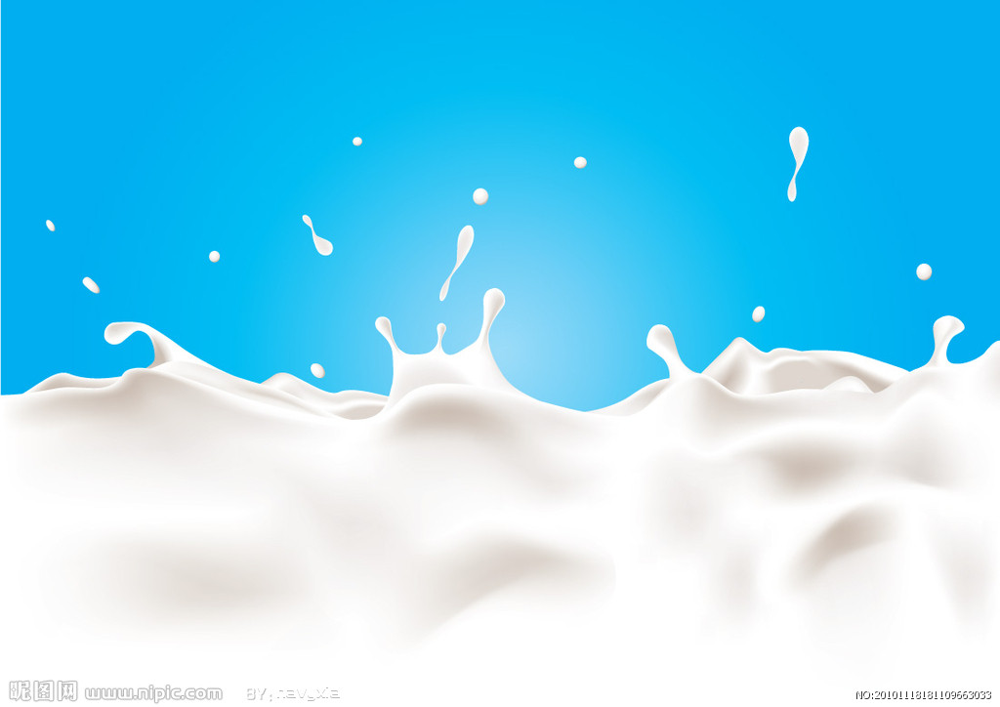
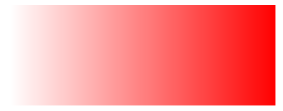
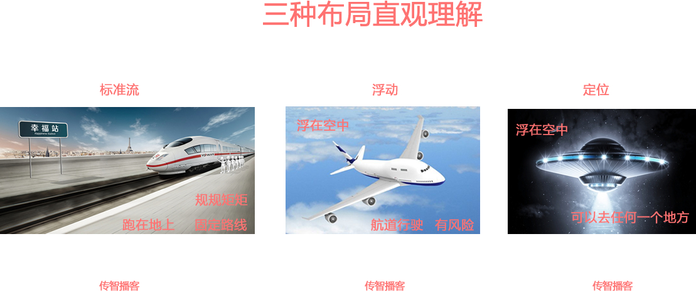
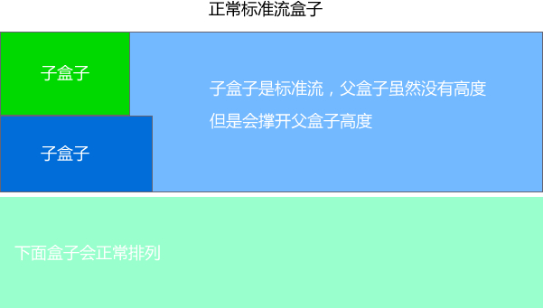
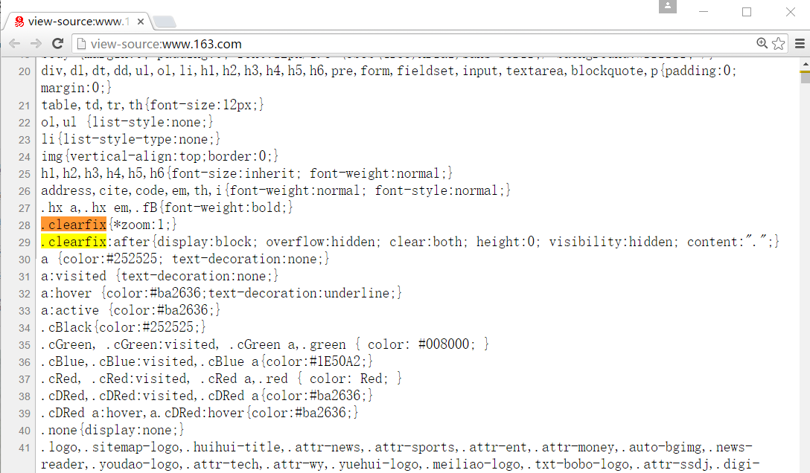

# CSS初识

   CSS(Cascading Style Sheets)

   CSS通常称为CSS样式表或层叠样式表（级联样式表），主要用于设置HTML页面中的文本内容（字体、大小、对齐方式等）、图片的外形（宽高、边框样式、边距等）以及版面的布局等外观显示样式。 

   CSS以HTML为基础，提供了丰富的功能，如字体、颜色、背景的控制及整体排版等，而且还可以针对不同的浏览器设置不同的样式。

##  三大特性：

###    1、层叠性

​            在同一标签中，如果定义的样式发生冲突，那最后一次定义的样式会覆盖掉前面定义的样式

​           CSS最后的执行口诀：  长江后浪推前浪，前浪死在沙滩上

​                          

###    2、继承性

- 只有在嵌套关系中才会出项

- 如果子元素默认没有样式，该元素会受父元素的样式影响

- color， font属性 ，text-align...都可以被子元素继承

  注意： 

     1、 width 和 height 不能被继承
     2、 a标签在默认情况下，不受父元素的文字颜色影响

     3、 标题标签在默认情况下，不能直接等于父元素设置的文字大小

  

  CSS最后的执行口诀：  龙生龙，凤生凤，老鼠生的孩子会打洞

  

###    3、优先级

         标签选择器 < 类选择器 < ID选择器 < 行内样式 < !important
           10         100      1000      10000     10000以上

- 继承的权重为0。即在嵌套结构中，不管父元素样式的权重多大，被子元素继承时，他的权重都为0，也就是说子元素定义的样式会覆盖继承来的样式。

- 权重可以叠加

- 权重相同时，CSS遵循就近原则。也就是说靠近元素的样式具有最大的优先级，或者说排在最后的样式优先级最大。

  #### CSS特殊性（Specificity）

  关于CSS权重，我们需要一套计算公式来去计算，这个就是 CSS Specificity，我们称为CSS 特性或称非凡性，它是一个衡量CSS值优先级的一个标准 具体规范入如下：

  specificity用一个四位的数 字串(CSS2是三位)来表示，更像四个级别，值从左到右，左面的最大，一级大于一级，数位之间没有进制，级别之间不可超越。 

  | 继承或者* 的贡献值       | 0,0,0,0  |
  | ------------------------ | -------- |
  | 每个元素（标签）贡献值为 | 0,0,0,1  |
  | 每个类，伪类贡献值为     | 0,0,1,0  |
  | 每个ID贡献值为           | 0,1,0,0  |
  | 每个行内样式贡献值       | 1,0,0,0  |
  | 每个!important贡献值     | ∞ 无穷大 |

   权重是可以叠加的

​      比如的例子：

```
    div ul  li   ------>      0,0,0,3

    .nav ul li   ------>      0,0,1,2

    a:hover      -----—>      0,0,1,1

    .nav a       ------>      0,0,1,1   

    #nav p       ----->       0,1,0,1
```

 注意： 

   1.数位之间没有进制 比如说： 0,0,0,5 + 0,0,0,5 =0,0,0,10 而不是 0,0, 1, 0， 所以不会存在10个div能赶上一个类选择器的情况。

2. 继承的 权重是 0

# 选择器

##  基础选择器

###   标签选择器（元素选择器）

```
  div { width: 100px; }
```

###   id选择器

```
 #app { color: red; }
```

​    元素的id值是唯一的，只能对应于文档中某一个具体的元素。

###   类选择器

​    .box { height: 200px; }

###   通配符选择器

```
* { padding: 0; margin: 0; }
```

​    能匹配页面中所有的元素

##  复合选择器

​     由两个或多个基础选择器，通过不同的方式组合而成的,目的是为了可以选择更准确更精细的目标元素标签。

###   子代选择器 

```
  .box > p
```

###   后代选择器

​    **空格**

```
  .box p { } 
```

###   并集选择器

```
  .box, .text { } 
```

###   交集选择器

```
   p.text { }  

   .box.text { }
```

###   兄弟选择器

```
   .box + .text { }
   
   选择 .box 元素后面相邻的元素，且类为 .text 
```

​      

###   通用兄弟选择器

```
   .box ~ .text { } 
   
   选择 .box 元素后面的所有 .text 选中的所有标签
```

###   属性选择器  

| **选择器               | **示例                                                       | **含义                                                       |
| ---------------------- | ------------------------------------------------------------ | ------------------------------------------------------------ |
| **li[attr]**           | **<li attr=''>西瓜</li>**                                    | 存在attr属性即可                                             |
| **li[attr='val']**     | **<li attr='val'>西瓜</li>**                                 | attr属性值完全等于val                                        |
| **li[attr\*='oo']**    | <li attr='good'>西瓜</li>                                    | attr属性值里包含val字符并且在“任意”位置                      |
| **li[attr^='val']**    | <li attr='value'>西瓜</li>                                   | attr属性值里包含val字符并且在“开始”位置                      |
| **li[attr$='ds']**     | <li attr='goods'>西瓜</li>                                   | attr属性值里包含val字符并且在“结束”位置                      |
| **li[type~='hot']**    | <li type='meat hot'>猪肉</li>                                | 使用空格分隔的多个属性，其中有hot属性即可                    |
| **li[price\|='very']** | **<li price='very-cheap'>红酒</li>**
**<li price='very'>白酒</li>** | 选择所有price属性值是用连字符 - 分隔的，或price属性的值 只有 very 的 |

 

###   伪类选择器

####    结构(位置)伪类选择器

```
    p:first-child        选取属于其父元素的首个子元素（在子元素中排第一），且必须是p标签
    p:last-child         选取属于其父元素的最后一个子元素，且必须是p标签
    p:nth-child(n)       选取属于其父元素的第 n 个子元素（在子元素中排第n），且必须是p标签 （n从1开始）
    p:nth-last-child(n)  选取属于其父元素的倒数第 N 个子元素，且必须是p标签  （n从1开始）
    p:nth-child(odd)     奇数  
    p:nth-child(even)    偶数
    
    li:only-child {}     选中其父元素只有一个li的子元素，独生子，有其他子元素则无法匹配
    
    li:not(:last-child)  选择父元素的子元素中的所有li元素中（不包括最后一个li元素） 
    
    li:first-of-type {}  选中属于其父元素的第一个li的子元素（不管li元素是在兄弟元素中排第几）
    li:last-of-type {}
    
    li:nth-of-type(n) {} 选中其父元素里的所有li元素中排第n的li元素，不管有无li以外的子元素（n从1开始）
    
    li:nth-last-of-type(n) {}  其父元素倒数第二个li元素，无视其他子元素
    
    li:only-of-type {}   选中其父元素只有一个li类型的子元素，其他子元素可以多个，但li必须只有一个, 当li有两个以上时无法匹配
    
    :checked    选中到单选按钮、复选框
    :disabled   不可编辑的或按钮不能点击的
    :enabled    可编辑或按钮能点击
```

####    

| 代码                                  | 视图                                    |
| ------------------------------------- | --------------------------------------- |
|  |  |
|  |  |

####    

####    目标伪类选择器     

```
    :target     跳转到锚点元素时，:target的自定义样式会作用在描点元素上  
          注： 1、目标伪类与描点连接配合使用
              2、只有当被描点链接指向该标签的时候才会执行目标伪类中的css代码
              
          应用：点击切换元素或图片
```

####    链接伪类选择器

```
   - :link      /* 未访问的链接 */
   - :visited   /* 已访问的链接 */
   - :hover     /* 鼠标移动到链接上 */
   - :active    /* 选定的链接 
                 鼠标按下时一瞬间的属性（移动端手指按下），也可以用于其他任意标签（如button）
               
              移动端应用： 手指按下背景色变色，抬起还原（ios可能不激活）
               span { background-color: #eee; }
               */
```

​    注:  写的时候，顺序尽量不要颠倒


```
   input:focus { }    当获取焦点时的样式
   a:focus { }      超链接也可以有焦点(点击a链接时获取焦点)
```


####    伪元素选择器

```
   ::first-line    选中第一行文字
   ::first-letter  选中第一个字母或汉字
   ::selection     设置鼠标选中区域的文本样式
```


####    伪元素

```
E::before 和 E::after
```


# 字体样式属性 (font)

##  font-size: 字号大小

| 值      | 含义                     |
| ------- | ------------------------ |
| medium  | 默认值                   |
| inherit | 从父元素继承字体尺寸     |
| 50%     | 基于父元素的一个百分比值 |
| 16px    | 设置为一个固定的值       |

##  font-family:字体

​    网页中常用的字体有宋体、微软雅黑、黑体等

​       p { font-family:"微软雅黑"; }

###    CSS Unicode字体

​         在 CSS 中设置字体名称，直接写中文是可以的。但是在文件编码（GB2312、UTF-8 等）不匹配时会产生乱码的错误。xp 系统不支持 类似微软雅黑的中文。

​         方案一： 你可以使用英文来替代。  比如  font-family:"Microsoft Yahei"

​         方案二： 在 CSS 直接使用 Unicode 编码来写字体名称可以避免这些错误。使用 Unicode 写中文字体名称，浏览器是可以正确的解析的。

| 字体名称    | 英文名称        | Unicode 编码         |
| ----------- | --------------- | -------------------- |
| 宋体        | SimSun          | \5B8B\4F53           |
| 新宋体      | NSimSun         | \65B0\5B8B\4F53      |
| 黑体        | SimHei          | \9ED1\4F53           |
| 微软雅黑    | Microsoft YaHei | \5FAE\8F6F\96C5\9ED1 |
| 楷体_GB2312 | KaiTi_GB2312    | \6977\4F53_GB2312    |
| 隶书        | LiSu            | \96B6\4E66           |
| 华文细黑    | STXihei         | \534E\6587\7EC6\9ED1 |
| 细明体      | MingLiU         | \7EC6\660E\4F53      |

## font-weight:字体粗细     

​    字体加粗除了用 strong 和 b 标签之外，可以使用CSS 来实现，但是CSS 是没有语义的

```
font-weight属性用于定义字体的粗细，其可用属性值：normal、bold、bolder、lighter、100~900（100的整数倍）。

    数字 400 等价于 normal，而 700 等价于 bold。
```

## font-style:字体风格

   字体倾斜除了用 em 和  i 标签之外，可以使用CSS 来实现

```
font-style: normal  |  italic  |  oblique

       normal    默认值，浏览器会显示标准的字体样式
       italic     斜体的字体样式
       oblique    倾斜的字体样式
```


## font: 综合设置字体样式

```
p {font: font-style  font-weight  font-size/line-height  font-family;}

p {font: italic   700  12px/30px  "Microsoft YaHei";}

注：必须按上面语法格式中的顺序书写，不能更换顺序，各个属性以空格隔开
   其中不需要设置的属性可以省略（取默认值），但必须保留font-size和font-family属性
```


# 文本属性

##  color: 文本颜色

​    用于定义文本的颜色，其取值方式有如下3种：

1.  预定义的颜色值，如red，green，blue等  
2.  十六进制，如#FF0000，#FF6600，#29D794等。实际工作中，十六进制是最常用的定义颜色的方式
3. rgb代码，如红色可以表示为rgb(255,0,0)或rgb(100%,0%,0%)。

​         注意：如果使用rgb代码的百分比颜色值，取值为0时也不能省略百分号，必须写为0%。

##  rgba():颜色半透明

```
  rgba()     rgb(0,0,0,0.8)
  
    r      red       红色     0-255

    g      green     绿色     0-255

    b      blue      蓝色     0-255

    a      alpha     透明     0-1
```

##  line-height: 行间距（行高）

   用于设置行间距，就是行与行之间的距离，即字符的垂直间距，一般称为行高    

```
  line-height:  normal  |  16px   |   50%    |  1.5   |  inherit  
   
        normal     默认。设置合理的行间距
        16px       设置固定的行间距
        50%        基于当前字体尺寸的百分比行间距    16px*50%
        1.5        此数字与当前的字体尺寸相乘来设置行间距   16px*1.5
        inherit    从父元素继承 line-height 属性的值
```

  行高 = 文字大小 + 上下间距

- 通过设置文字的行高，改变的就是文字的上下间距
- 不设置行高时，文字的大小也会影响行高
- 文字字体也会影响行高

当父元素设置行高时，如设置font-size: 18px;

```css
   父元素(行高)        子元素(行高)
     20px              20px    （直接继承）
     20em              18*20px  (父元素文字大小*父元素的行高)（与子元素的文字大小无关）
     10%               18*10%   (父元素文字大小*父元素的行高)（与子元素的文字大小无关）
     2                 2        (父元素的行高)*子元素文字大小（先继承后计算）
```

##  text-align: 水平对齐方式

​    用于设置文本内容的水平对齐

```
  text-align: left   |  right   |   center
```

##  text-indent: 首行缩进

​    用于设置首行文本的缩进，建议使用em作为设置单位，1em 就是一个字的宽度（如果是汉字的段落， 1em 就是一个汉字的宽度）

##  letter-spacing: 字间距

​    用于定义字间距，就是字符与字符之间的空白

```
   letter-spacing:  normal  |  3  |  inherit
      
       normal	默认。规定字符间没有额外的空间
       3        定义字符间的固定空间（允许使用负值）
       inherit  从父元素继承 letter-spacing 属性的值
```

##  word-spacing: 单词间距

​    用于定义英文单词之间的间距，对中文字符无效，和letter-spacing一样

```
   word-spacing 和 letter-spacing 均可对英文进行设置。
   不同的是 letter-spacing 定义的为字母之间的间距，而 word-spacing 定义的为英文单词之间的间距。
```

##  text-shadow: 文字阴影

```
  text-shadow: 水平位置 垂直位置 模糊距离 阴影颜色;
```


### 凹凸文字

```
<head>
  <meta charset="utf-8">
     <style>
        body {
            background-color: #ccc;
        }
        div {
            color: #ccc;
            font: 700 80px "微软雅黑";
        }
        div:first-child {
            /* text-shadow: 水平位置  垂直位置  模糊距离 阴影颜色; */
            text-shadow: 1px 1px 1px #000, -1px -1px 1px #fff;
        }
        div:last-child {
            /* text-shadow: 水平位置  垂直位置  模糊距离 阴影颜色; */
            text-shadow: -1px -1px 1px #000, 1px 1px 1px #fff;
        }

     </style>
   </head>
   <body>
      <div>我是凸起的文字</div>
      <div>我是凹下的文字</div>
   </body>
```


## text-decoration: 文本装饰

| 值           | 描述                                          |
| ------------ | --------------------------------------------- |
| none         | 默认。定义标准的文本。                        |
| underline    | 定义文本下的一条线。下划线 也是我们链接自带的 |
| overline     | 定义文本上的一条线。                          |
| line-through | 定义穿过文本下的一条线。                      |


# 引入CSS样式表

##  行内式（内联式）

```
  <div style="width: 100px; background-color: blue;"></div>
```

##  内部样式（内嵌式）

```
  <style type="text/CSS">
    .box { width: 100px; background-color: blue; }
  </style>
```

##  外部样式（外链式）

```
  <head>
     <link href="CSS文件的路径" type="text/CSS" rel="stylesheet" />
  </head>
```

| 样式表   | 优点                     | 缺点                     | 使用情况       | 控制范围           |
| -------- | ------------------------ | ------------------------ | -------------- | ------------------ |
| 行内样式 | 书写方便，权重高         | 没有实现样式和结构相分离 | 较少           | 控制一个标签（少） |
| 内嵌样式 | 部分结构和样式相分离     | 没有彻底分离             | 较多           | 控制一个页面（中） |
| 外部样式 | 完全实现结构和样式相分离 | 需要引入                 | 最多，强烈推荐 | 控制整个站点（多） |


# 标签显示模式 (display)

##  块级元素 (block)

```
   display: block;
   
   常见的块元素有<h1>~<h6>、<p>、<div>、<ul>、<ol>、<li>等，其中<div>标签是最典型的块元素。
```

   特点：

1.  总是从新行开始       
2.  高度，行高、外边距以及内边距都可以控制
3.  宽度默认是容器的100%
4.  可以容纳内联元素和其他块元素

##  行内元素 (inline)

```
    display: inline;

    常见的行内元素有<a>、<strong>、<b>、<em>、<i>、<del>、<s>、<ins>、<u>、<span>等，其中<span>标签最典型的行内元素。
```

   特点：

1.  和相邻行内元素在一行上
2.  高、宽设置无效，但水平方向的padding和margin可以设置，垂直方向的设置无效
3.  默认宽度就是它本身内容的宽度
4.  行内元素只能容纳文本或则其他行内元素

  注意：p 元素里面不能放块级元素，同理还有这些标签h1,h2,h3,h4,h5,h6,dt，他们都是文字类块级标签，里面不能放其他块级元素。

##  行内块元素（inline-block）

```
  display: inline-block;
  
  在行内元素中有几个特殊的标签  、<input />、<td>，可以对它们设置宽高和对齐属性，有些资料可能会称它们为行内块元素。
```

   特点：

1.  和相邻行内元素（行内块）在一行上,但是之间会有空白缝隙

2.  默认宽度就是它本身内容的宽度

3.  高度，行高、外边距以及内边距都可以控制

   

| 显示模式   | 形状 | 图片                      |
| ---------- | ---- | ------------------------- |
| 块级元素   | 面包 |  |
| 行内元素   | 牛奶 |  |
| 行内块元素 | 果冻 |  |


# 背景(background)

   可以添加背景颜色和背景图片

| background-color        | 背景颜色         |
| ----------------------- | ---------------- |
| background-image: url() | 背景图片地址     |
| background-repeat       | 是否平铺         |
| background-position     | 背景位置         |
| background-attachment   | 背景固定还是滚动 |

  背景的合写（复合属性）   

​     background: 背景颜色 背景图片地址 背景平铺 背景滚动 背景位置

```css
 background: red  url(image/1.jpg) no-repeat scroll 50% 0
```

## 背景颜色

```
background-color: transparent | red ...
                     透明
```

## 背景图片

```css
background-image : none | url (image/1.jpg) 
```

## 背景平铺

```css
background-repeat : repeat | no-repeat | repeat-x | repeat-y 
```

​    repeat : 　    背景图像在纵向和横向上平铺（默认的）

​    no-repeat : 　背景图像不平铺

​    repeat-x : 　背景图像在横向上平铺

​    repeat-y : 　背景图像在纵向平铺 

设置背景图片时，默认把图片在水平和垂直方向平铺以铺满整个元素。

## 背景位置

```css
background-position : length || length

background-position : top || right 
```

​    length : 　百分数 | 由浮点数字和单位标识符组成的长度值
​    position : 　top | bottom | left | right  |  center

 说明：

​     如果只指定了一个值，该值将用于横坐标，纵坐标将默认为50%（center）。

####  background-origin: 背景图片的定位区域

  背景图片可以放置于 content-box、padding-box 或 border-box 区域

```
background-origin: content-box  |  padding-box  |  border-box ;
                                    默认值
```

#### background-clip: 属性规定背景的绘制区域

```
background-clip: border-box | padding-box | content-box;
                   默认值
```

|                                      |                                                              |
| ------------------------------------ | ------------------------------------------------------------ |
| border-box                           | 表示元素的背景从border区域（包括border）以内开始保留背景，     背景图则会有不同于背景色的情况，如下图 |
|  |                         |
|                                      |                                                              |
| padding-box                          | 表示元素的背景从padding区域(包括padding)以内开始保留，border区域的背景会被裁剪掉 |
|  |                          |
|                                      |                                                              |
| content-box                          | 表示元素的背景从内容区域以内开始保留，border和padding区域的背景会被裁剪掉 |
|  |                          |

```
background: url() content-box;   等价于下面的

    background-image: url();
    background-origin: content-box;
    background-clip: content-box;
```


## 背景附着

```css
background-attachment : scroll | fixed 
```

​    scroll : 　背景图像是随对象内容滚动

​    fixed : 　背景图像固定 

## 背景透明

```
background: rgba(0,0,0,0.3)
```

 注意：  背景半透明是指盒子背景半透明， 盒子里面的内容不受影响

## 背景缩放

```
background-size: 100px 200px

background-size: contain; 
background-size: cover; 
```

其参数设置如下：

   a) 可以设置长度单位(px)或百分比（设置百分比时，参照盒子的宽高）

   b) 设置为cover时，会自动调整缩放比例，保证图片始终填充满背景区域，如有溢出部分则会被隐藏。我们平时用的cover 最多（按背景图片的宽高中短的为盒子宽高中长的）

|                                | background-size: cover         |
| ------------------------------ | ------------------------------ |
|  |  |

   c) 设置为contain会自动调整缩放比例，保证图片始终完整显示在背景区域。

​       

## 多背景

- 一个元素可以设置多重背景图像。 
- 每组属性间使用逗号分隔。 
- 如果设置的多重背景图之间存在着交集（即存在着重叠关系），前面的背景图会覆盖在后面的背景图之上。
- 为了避免背景色将图像盖住，背景色通常都定义在最后一组上

```
background:url(test1.jpg) no-repeat scroll 10px 20px/50px 60px,
	       url(test1.jpg) no-repeat scroll 10px 20px/70px 90px,
	       url(test1.jpg) no-repeat scroll 10px 20px/110px 130px c #aaa;
```

## 背景渐变

### 线性渐变

​    背景颜色由一种颜色向另外一种颜色渐变

```
  background: linear-gradient (
      to right,      /* 渐变的方向从左向右， 右下角（to bottom right）, 默认为从上到下 */
      red,           /* 渐变的开始颜色 */
      green          /* 渐变的结束颜色 */
  )
```

 

```
 background: linear-gradient(
     90deg,      /* 渐变的角度（和to right的效果一样） */
                /*  0deg（和to top的效果一样） */
     red 50%,             /* 0%到50%区域是红色向红色的渐变 */
     green 100%           /* 50%到100%区域是红色向蓝色渐变 */
 )
```


```
background: linear-gradient (
      to right,      
      red 25%,        /* 25%-50%的区域是red向blue渐变 */
      blue 50%,       /* 50%-75% 是blue向green渐变 */
      green 75%       /* 75%-100% 是green向green渐变 */
)     
```

​       

```
background: linear-gradient (
      to right,      
      red 25%,        /* 25%-50%的区域是red向blue渐变 */
      blue 50%,       /* 50%-75% 是blue向green渐变 */
      green 75%       /* 75%-100% 是green向green渐变 */
)  
background-size: 200px 100px;
   /* 没有设置background-size属性时，百分比是相对于盒子元素的宽高
      设置了background-size属性时，百分比是相对于background-size设置的宽高  */
```


#### 使用透明度（transparent）

```
background: linear-gradient(
  to right, 
  rgba(255,0,0,0), 
  rgba(255,0,0,1)
);
```



#### 重复的线性渐变

```
background: repeating-linear-gradient(
    red, 
    yellow 10%, 
    green 60%
);
```


### 径向渐变

####   等间距色标

```
background: radial-gradient (yellow, red, blue);
                          默认为椭圆
```


#### 指定间距色标

```
background: radial-gradient(circle, red 25%, yellow 35%, #1E90FF 50%);
                             圆
```

​     

```
background: radial-gradient(ellipse closest-side, red, yellow 10%, #1E90FF 50%, white);
     closest-side   表示百分比是基于盒子长宽中较小的来计算， 默认为farthest-corner
```


```
background: radial-gradient(
    circle 200px at top center,     //表示圆心在盒子最上方正中，圆半径为200px， 默认为100px
                                        默认圆心在盒子正中心
    red, 
    yellow, 
    #1E90FF
);
```

  

####    重复的径向渐变

```
background: repeating-radial-gradient(black, black 5px, white 5px, white 10px);
```

   

# 盒子模型

  其实，CSS就三个大模块：  盒子模型 、 浮动 、 定位，其余的都是细节。

  所谓盒子模型就是把HTML页面中的元素看作是一个矩形的盒子，也就是一个盛装内容的容器。每个矩形都由元素的内容、内边距（padding）、边框（border）和外边距（margin）组成。


## 盒子边框（border）

```css
border : border-width || border-style || border-color 
border:   1px solid red;
```

```
border-width: medium  |  thin  |  thick  |   length   |  inherit
           默认。中等边框  细边框    粗边框    自定义边框的宽度
```

```
border-style:  none  |  solid  |  dashed  |   dotted   |   double
                        单实线      虚线         点线         双实线
```

 盒子边框写法总结表

|              |                                                              |                                                              |
| ------------ | ------------------------------------------------------------ | ------------------------------------------------------------ |
| 设置内容     | 样式属性                                                     | 常用属性值                                                   |
| 上边框       | border-top-style:样式; border-top-width:宽度;border-top-color:颜色;border-top:宽度 样式 颜色; |                                                              |
| 下边框       | border-bottom-style:样式;border- bottom-width:宽度;border- bottom-color:颜色;border-bottom:宽度 样式 颜色; |                                                              |
| 左边框       | border-left-style:样式; border-left-width:宽度;border-left-color:颜色;border-left:宽度 样式 颜色; |                                                              |
| 右边框       | border-right-style:样式;border-right-width:宽度;border-right-color:颜色;border-right:宽度 样式 颜色; |                                                              |
| 样式综合设置 | border-style:上边 [右边 下边 左边];                          | none无（默认）、solid单实线、dashed虚线、dotted点线、double双实线 |
| 宽度综合设置 | border-width:上边 [右边 下边 左边];                          | 像素值                                                       |
| 颜色综合设置 | border-color:上边 [右边 下边 左边];                          | 颜色值、#十六进制、rgb(r,g,b)、rgb(r%,g%,b%)                 |
| 边框综合设置 | border:四边宽度 四边样式 四边颜色;                           |                                                              |

### 表格的细线边框

   html表格边框很粗，这里只需要CSS一句话就可以美观起来

```
  table{ border-collapse:collapse; }     //表示边框合并在一起
```

### 圆角边框

```css
  border-radius: 左上角  右上角  右下角  左下角;

  border-radius: 10px 40px 80px 100px;  /* 左上角10  右上角40  右下角80  左下角、右下角100*/
  border-radius: 10px 40px  80px;   /* 左上角 10    右上角  左下角 40   右下角80 */
  border-radius: 10px;  /*  一个数值表示4个角都是相同的 10px 的弧度 */ 
  border-radius: 50%;
```

## 内边距（padding）

  指 边框与内容之间的距离

```
padding: 上  右  下  左

padding: auto  |  length  |  %  |  inherit
                          
    %	  基于父元素的宽度来计算                    
```

## 外边距（margin）

  设置外边距，会在元素之间创建“空白”， 这段空白通常不能放置其他内容

```
margin:上外边距 右外边距  下外边距  左外边

margin: auto  |  length  |  %  |  inherit
                          
    %	  基于父元素的宽度来计算  
```

### 外边距实现盒子居中

 可以让一个盒子实现水平居中，需要满足一下两个条件：

​     1、必须是块级元素。    

​     2、盒子必须指定了宽度（width）

```
.header{ width:960px; margin:0 auto;}
```

### 相邻块元素垂直外边距的合并

​    当上下相邻的两个块元素相遇时，如果上面的元素有下外边距margin-bottom，下面的元素有上外边距margin-top，则他们之间的垂直间距不是margin-bottom与margin-top之和，而是两者中的较大者。这种现象被称为相邻块元素垂直外边距的合并（也称外边距塌陷）。


​       解决方案：  避免就好了。

### 嵌套块元素垂直外边距的合并

​    对于两个嵌套关系的块元素，如果父元素没有上内边距及边框，则父元素的上外边距会与子元素的上外边距发生合并，合并后的外边距为两者中的较大者，即使父元素的上外边距为0，也会发生合并。


  解决方案：

1.  可以为父元素定义1像素的上边框或上内边距。
2.  可以为父元素添加overflow:hidden。

## 盒模型

​    可以通过box-sizing 来指定盒模型，即可指定为content-box、border-box，这样我们计算盒子大小的方式就发生了改变。

```
box-sizing: content-box   |  border-box
```

## 盒子阴影 box-shadow

```
box-shadow: 水平阴影 垂直阴影 模糊距离 阴影尺寸 阴影颜色  内/外阴影；

box-shadow: 0 15px 30px  rgba(0, 0, 0, .4);
```

  

 外阴影 (outset) 但是不能写,    是默认的。      想要内阴影  inset 

###  盒子外阴影

```
 box-shadow: 5px 5px 10px green;
```

###  盒子内阴影

```
 box-shadow: 5px 5px 10px green inset;
```


# CSS的定位机制

  CSS的定位机制有3种：普通流（标准流）、浮动和定位。



## 普通流

​    就是一个网页内标签元素正常从上到下，从左到右排列顺序的意思，比如块级元素会独占一行，行内元素会按顺序依次前后排列；按照这种大前提的布局排列之下绝对不会出现例外的情况叫做普通流布局。

## 浮动

​    浮动最早是用来控制图片，以便达到其他元素（特别是文字）实现“环绕”图片的效果


​     后来，我们发现浮动可以让任何盒子一行排列，因此我们就慢慢的偏离主题，用浮动的特性来布局了


### 什么是浮动？

​    是指设置了浮动属性的元素会脱离标准普通流的控制，移动到其父元素中指定位置的过程

```
   .box { float: left; }
```

| 属性值 | 描述                 |
| ------ | -------------------- |
| left   | 元素向左浮动         |
| right  | 元素向右浮动         |
| none   | 元素不浮动（默认值） |

####   特性:

​     1、脱离标准流，不占位置，会影响标准流。

​     2、只有左右浮动

​     3、元素会具有行内块元素的特性

​     4、浮动首先创建包含块的概念（包裹）。就是说， 浮动的元素总是找它最近的父级元素对齐。但是不会超出内边距的范围。

​           

  总结：浮动的目的就是为了让多个块级元素同一行上显示

### 版心和布局流程

  阅读报纸时容易发现，虽然报纸中的内容很多，但是经过合理地排版，版面依然清晰、易读。同样，在制作网页时，要想使页面结构清晰、有条理，也需要对网页进行“排版”。

  “版心”(可视区) 是指网页中主体内容所在的区域。一般在浏览器窗口中水平居中显示，常见的宽度值为960px、980px、1000px、1200px等。

#### 一列固定宽度且居中

​                                 

#### 两列左窄右宽型

​                                 

#### 通栏平均分布型

​                     

## 清除浮动

###   为什么要清除浮动

​     由于浮动元素不再占用原文档流的位置，所以它会对后面的元素排版产生影响，为了解决这些问题，此时就需要在该元素中清除浮动。

​     准确地说，并不是清除浮动，而是**清除浮动后造成的影响**

​     清除浮动主要为了解决**父级元素因为子级浮动引起内部高度为0 的问题**

​                   

​                  

### 清除浮动的方法

   其实本质叫做闭合浮动更好一些，清除浮动就是把浮动的盒子圈到里面，让父盒子闭合出口和入口不让他们出来影响其他元素。

  clear属性用于清除浮动

```
clear: left  |  right  |  both
```

| 属性值 | 描述                                       |
| ------ | ------------------------------------------ |
| left   | 不允许左侧有浮动元素（清除左侧浮动的影响） |
| right  | 不允许右侧有浮动元素（清除右侧浮动的影响） |
| both   | 同时清除左右两侧浮动的影响                 |

#### 1、额外标签法

```css
 在浮动元素末尾添加一个空的标签例如 <div style="clear:both"></div>
```

​    优点： 通俗易懂，书写方便

​    缺点： 添加许多无意义的标签，结构化较差。

#### 2、父级添加overflow属性方法

​    通过触发BFC的方式，可以实现清除浮动效果

```css
给父级添加： overflow: hidden | auto | scroll  都可以实现
```

   优点：  代码简洁

   缺点：  内容增多时候容易造成不会自动换行导致内容被隐藏掉，无法显示需要溢出的元素。

#### 3、使用after伪元素清除浮动

```
 .clearfix::after {  
     content: ""; 
     display: block; 
     height: 0; 
     line-height: 0px;
     clear: both; 
     visibility: hidden;  
 }   
```

​    优点： 符合闭合浮动思想，  结构语义化正确

​    缺点： 由于IE6-7不支持:after，使用 zoom:1会触发 hasLayout。



  注意：在firefox 7.0以前的版本， content:"."  里面尽量跟一个小点，或者其他，尽量不要为空，否则会生成空格。

#### 4 、使用before和after双伪元素清除浮动

```
.clearfix::before, .clearfix::after { 
    content: "";
    display: table;  /* 这句话可以出发BFC BFC可以清除浮动,BFC我们后面讲 */
}
.clearfix::after {
    clear: both;
}
```

   优点：  代码更简洁

## 定位(position)

```
  position:  static  |  relative  |  absolute  |  fixed
```

| 值       | 描述                                             |
| -------- | ------------------------------------------------ |
| static   | 自动定位（默认定位方式）                         |
| relative | 相对定位，相对于其原文档流的位置进行定位         |
| absolute | 绝对定位，相对于其上一个已经定位的父元素进行定位 |
| fixed    | 固定定位，相对于浏览器窗口进行定位               |

### 静态定位(static)

  静态定位是所有元素的默认定位方式， 其实就是标准流的特性，无法通过边偏移属性（top、bottom、left或right）来改变元素的位置

### 相对定位(relative)

特点：   

1. 相对定位最重要的一点是，它可以移动位置，但是原来的所占的位置，继续占有。
2. 其次，每次移动的位置，是以自己的左上角为基点移动（相对于自己来移动位置）

  相对定位的盒子仍在标准流中，它后面的盒子仍以标准流方式对待它。（相对定位不脱标）

### 绝对定位(absolute) 

  特点:   1、如果文档可滚动，绝对定位元素会随着它滚动，因为元素最终会相对于正常流的某一部分定位。

​              2、移动位置后，但是它完全脱标，完全不占位置。

​              3、绝对定位是将元素依据最近的已经定位（绝对、固定或相对定位）的父元素（祖先）进行定位

​              4、若所有父元素都没有定位，以浏览器为准对齐(document文档)

##### 绝对定位的盒子水平/垂直居中

  普通的盒子是左右margin 改为 auto就可， 但是对于绝对定位就无效了

   定位的盒子也可以水平或者垂直居中，有一个算法。

1. 首先left 50%,   父盒子的一半大小
2. 然后走自己外边距负的一半值就可以了 margin-left。

### 固定定位(fixed)

   它将脱离标准文档流的控制，始终依据浏览器窗口来定义自己的显示位置

   不管浏览器滚动条如何滚动也不管浏览器窗口的大小如何变化，该元素都会始终显示在浏览器窗口的固定位置

  特点：

​     1、固定定位的元素跟父亲没有任何关系，只认浏览器。

​     2、固定定位完全脱标，不占有位置，不随着滚动条滚动。

### 叠放次序（z-index）

​    当对多个元素同时设置定位时，定位元素之间有可能会发生重叠。

​    要想调整重叠定位元素的堆叠顺序，可以对定位元素应用z-index层叠等级属性，其取值可为正整数、负整数和0。

  注意：

1. z-index的默认属性值是0，取值越大，定位元素在层叠元素中越居上。
2. 如果取值相同，则根据书写顺序，后来居上。
3. 后面数字一定不能加单位。
4. 只有相对定位，绝对定位，固定定位有此属性，其余标准流，浮动，静态定位都无此属性，亦不可指定此属性。

## 四种定位总结

| 定位模式         | 是否脱标占有位置     | 是否可以使用边偏移 | 移动位置基准                     |
| ---------------- | -------------------- | ------------------ | -------------------------------- |
| 静态static       | 不脱标，正常模式     | 不可以             | 正常模式                         |
| 相对定位relative | 不脱标，占有位置     | 可以               | 相对自身位置移动（自恋型）       |
| 绝对定位absolute | 完全脱标，不占有位置 | 可以               | 相对于定位父级移动位置（拼爹型） |
| 固定定位fixed    | 完全脱标，不占有位置 | 可以               | 相对于浏览器移动位置（认死理型） |

### 定位模式转换

​    跟 浮动一样， 元素添加了 绝对定位和固定定位之后， 元素模式也会发生转换， 都转换为 行内块模式

​     因此：行内元素 如果添加了 绝对定位或者 固定定位后 浮动后，可以不用转换模式，直接给高度和宽度就可以了

# 元素的显示与隐藏

##  display 显示

```
display: none  |  block
```

 特点： 隐藏之后，不再保留(占据)位置

##  visibility 可见性

```
visibility:  visible  |  hidden 
```

 特点： 隐藏之后，继续保留原有位置。（停职留薪）

##  overflow 溢出

```
 overflow: visible  |  auto   |   hidden   |   scroll 
```

​    visible : 　不剪切内容也不添加滚动条。

​    hidden : 　不显示超过对象尺寸的内容，超出的部分隐藏掉 

​    scroll : 　  不管超出内容否，总是显示滚动条

​    auto : 　   超出自动显示滚动条，不超出不显示滚动条    

# opacity

颜色和图片都会有透明效果

若不需望文字透明，只是颜色，则使用

```
background-color: rgba(255,255,255,.9);
```


# 用户界面样式

##  鼠标样式cursor

   设置或检索在对象上移动的鼠标指针采用何种系统预定义的光标形状。

```
cursor :  default  小白 | pointer  小手  | move  移动  |  text  文本
```

##  轮廓 outline

  是绘制于元素周围的一条线，位于边框边缘的外围，可起到突出元素的作用。

```
 outline : outline-color  ||  outline-style  ||  outline-width 
```

 平时都是去掉的。最直接的写法是 ：  outline: 0;   或者  outline: none;

```
 <input  type="text"  style="outline: 0;"/>
```

## 防止拖拽文本域 resize

   resize：none    这个单词可以防止 火狐 谷歌等浏览器随意的拖动 文本域 textarea。

 右下角可以拖拽： 

<textarea></textarea>

右下角不可以拖拽： 

<textarea  style="resize: none;"></textarea>

## vertical-align 垂直对齐

  前面有让带有宽度的块级元素居中对齐，是margin: 0 auto;

  前面有让文字居中对齐，是 text-align: center;

  vertical-align 垂直对齐


```
vertical-align : baseline | top | middle | bottom 
```

   vertical-align 不影响块级元素中的内容对齐，它只针对于 行内元素或者行内块元素，特别是行内块元素， **通常用来控制图片/表单与文字的对齐**。


### 图片、表单和文字对齐

   默认的图片会和文字基线对齐

### 去除图片底侧空白缝隙

   图片或者表单等行内块元素，他的底线会和父级盒子的基线对齐。这样会造成一个问题，就是图片底侧会有一个空白缝隙。


  解决的方法: 

​    1、给img   vertical-align:middle | top等。  让图片不要和基线对齐。

​    2、给img  添加 display：block;  转换为块级元素就不会存在问题了。

​                          

## word-break: 自动换行

  主要处理英文单词

```
word-break: normal   |   break-all   |   keep-all
```

​    normal   使用浏览器默认的换行规则。

​    break-all   允许在单词内换行，单词内部允许断行

​    keep-all    只能在半角空格或连字符处换行。

## white-space

  可以处理中文

```
white-space: normal  |  nowrap
```

```
  normal : 　默认处理方式

     空白(如 空格键，多个空格键保留一个)， 空白符系列(如&nbap; 有几个保留几个)，不保留换行符， 文本超出正常换行
```

```
   nowrap : 　强制在同一行内显示所有文本，直到文本结束或者遭遇br标签对象才换行。

      空白(如 空格键，多个空格键只也保留一个)， 保留空白符系列(如&nbap; 有几个保留几个)，换行符（如 Enter键换行， 有多个也默认为一个空白），文本超出不换行，有换行符也不换行, 遭遇br标签对象才换行
```

## text-overflow 文字溢出

```
text-overflow : clip | ellipsis
```

  是否使用一个省略标记（...）标示对象内文本的溢出

​     clip : 　不显示省略标记（...），而是简单的裁切 

​     ellipsis : 　当对象内文本溢出时显示省略标记（...）

###  一行文本溢出显示省列号(...)

```
    overflow: hidden;
    text-overflow: ellipsis;
    white-space: nowrap:
```

## 字体图标

​    图片是有诸多优点的，但是缺点很明显，比如图片不但增加了总文件的大小，还增加了很多额外的"http请求"，这都会大大降低网页的性能的。更重要的是图片不能很好的进行“缩放”，因为图片放大和缩小会失真。 我们后面会学习移动端响应式，很多情况下希望我们的图标是可以缩放的。此时，一个非常重要的技术出现了，额不是出现了，是以前就有，是被从新"宠幸"啦。。 这就是字体图标（iconfont).

#####   优点

   1、可以做出跟图片一样可以做的事情,改变透明度、旋转度，等..
   2、但是本质其实是文字，可以很随意的改变颜色、产生阴影、透明效果等等...
   3、本身体积更小，但携带的信息并没有削减。
   4、几乎支持所有的浏览器
   5、移动端设备必备良药...

## 过渡 transition

```
transition: 要过渡的属性  花费时间  运动曲线  何时开始;

transition:  all  1s ease 2s;
```

| 属性                       | 描述                                         |
| -------------------------- | -------------------------------------------- |
| transition                 | 简写属性，用于在一个属性中设置四个过渡属性。 |
| transition-property        | 规定应用过渡的 CSS 属性的名称。              |
| transition-duration        | 定义过渡效果花费的时间。默认是 0。           |
| transition-timing-function | 规定过渡效果的时间曲线。默认是 "ease"。      |
| transition-delay           | 规定过渡效果何时开始。默认是 0。             |

  如果想要所有的属性都变化过渡， 写一个all 就可以

  transition-duration  花费时间  单位是  秒     s    比如 0.5s    这个s单位必须写      ms 毫秒

  运动曲线   默认是 ease

  何时开始  默认是 0s  立马开始

  运动曲线示意图：

  

## 2D变形 transform

  可以实现元素的位移、旋转、倾斜、缩放，甚至支持矩阵方式

```
 transform :  translate(x, y)     移动
 transform :  scale(x, y)         缩放
 transform :  rotate(deg)         旋转
 transform :  skew(deg, deg)      倾斜
```

### 移动 translate(x, y)    

 使用translate方法来将文字或图像在水平方向和垂直方向上分别垂直移动

```
translate(50px,50px);
```

   

   让定位的盒子水平居中

```
.box {
  width: 499.9999px;
  height: 400px;
  background: pink;
  position: absolute;
  left:50%;
  top:50%;
  transform:translate(-50%,-50%);  /* 走的自己的一半 */
}
```

### 缩放 scale(x, y) 

​    可以对元素进行水平和垂直方向的缩放

​    一个参数时，表示水平和垂直方向都缩放该倍数

```
transform: scale(0.8, 1);      //使该元素在水平方向上缩小了20%，垂直方向上不缩放
```

​    

  scale()的取值默认的值为1，当值设置为0.01到0.99之间的任何值，作用使一个元素缩小；而任何大于或等于1.01的值，作用是让元素放大

### 旋转 rotate(deg) 

  可以对元素进行旋转，正值为顺时针，负值为逆时针； 默认以元素中心点为轴旋转

```
transform: rotate(45deg);
```

  

#### transform-origin 可以调整元素转换变形的原点

```
div {
  transform-origin: left top;
  transform: rotate(45deg); 
}                     
    /* 改变元素旋转点到左上角，然后进行顺时旋转45度 */ 
    
 也可以用  px 像素
 transform-origin: 10px 10px;
```

 

### 倾斜 skew(deg, deg) 

  可以使元素按一定的角度进行倾斜，可为负值，第二个参数不写默认为0

```
transform: skew(30deg,0deg);     //把元素水平方向上倾斜30度，处置方向保持不变
```

  

## 3D变形(CSS3) transform

### 移动

|                    |                                                              |
| ------------------ | ------------------------------------------------------------ |
| translateX(x)      | 仅水平方向移动（X轴移动）                                    |
| translateY(y)      | 仅垂直方向移动（Y轴移动）                                    |
| translateZ(z)      | 直观表现形式就是大小变化，实质是XY平面相对于视点的远近变化   |
| translate3d(x,y,z) | x和y可以是长度值，也可以是百分比，百分比是相对于其本身元素水平方向的宽度和垂直方向的高度和；z只能设置长度值 |

### 旋转

|                           |                                 |
| ------------------------- | ------------------------------- |
| transform: rotateX(45deg) |  |
| transform: rotateY(45deg) |  |
| transform: rotateZ(45deg) |  |

```
transform-origin: 0 20px;  改变X旋转轴的上下位移
transform-origin: 20% 0;  改变Y旋转轴的左右位移
```

#### 透视(perspective)

```
  perspective: 600px;   透视  （放在父元素上, 作用于所有3D转换的子元素）
```

​    电脑显示屏是一个2D平面，图像之所以具有立体感（3D效果），其实只是一种视觉呈现，通过透视可以实现此目的。

   perspective：视距，表示视点距离屏幕的长短。视点，用于模拟透视效果时人眼的位置

#### transform-style

```
transform-style: preserve-3D;  将平面图行转换为立体图形
```

#### backface-visibility

  定义当元素不面向屏幕时是否可见

```
backface-visibility: hidden;    //背面不可变
```

### 缩放

```
 transform: scaleX()
                 Y
                 Z
```

## 动画 animation

  常用来实现复杂的动画效果

```
animation: 动画名称 动画时间 运动曲线  何时开始  播放次数  是否反方向;
```

  

```
 animation: run 10s linear 0s infinite alternate;
     run       运动名称
     10s       运动时间
     linear    缓冲ease不匀速
                   linear匀速
     0s        延迟时间
     infinite  执行次数  
                infinite 无限
     alternate 来回运动
```

  关于几个值，除了名字，动画时间，延时有严格顺序要求其它随意

1、先定义动画

```css
@keyframes 动画名称 {
   from{ 开始位置 }  0%
   to{  结束  }  100%
}

    @keyframes yundong {
       from {
          left: 100px;

       }
       to {
          left: 600px;
       }
    }
    
    //定义动画(可用百分比)(比分比是时间)(from对应0%，to对应100%)
     0% {
         left:100px;
     }
     90% {
         left:150px;
     }
     100% {
         left:600px;
     }
```

2、使用animation属性调用

```
animation: yundong 10s linear 0s;
```

```
animation-iteration-count: infinite;  无限循环播放
animation-play-state: paused;     暂停动画"
```


网页优化

   内容移出  text-indent: -5000em    |  padding-tap: 100px;