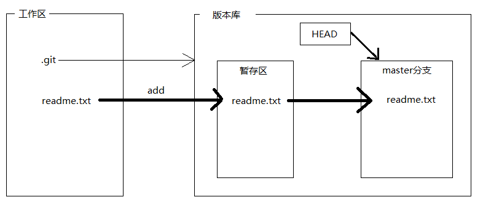
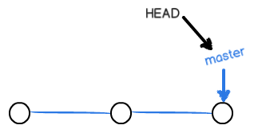
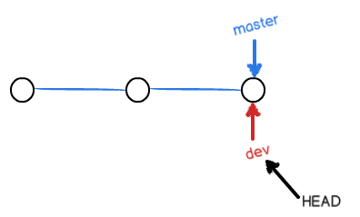
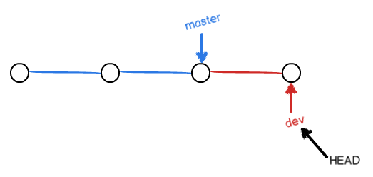
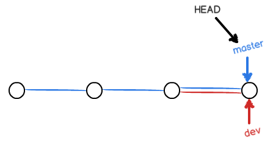
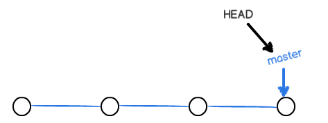
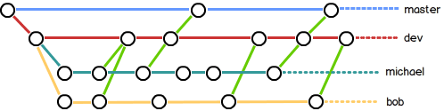
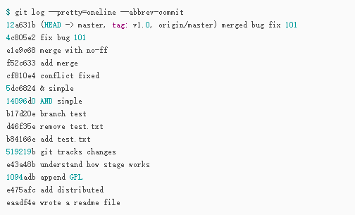

# Git

   Git是一款源代码管理工具(版本控制工具)


   版本控制工具

​       1、集中式    SVN

​       2、分布式    Git

# Git安装

  直接下载Git，然后安装

  再配置：  

```
git config --global user.name "Your name"    // 设置自己的名称
git config --global user.email "email@example.com"  //设置邮箱
```

# Git使用

##    1、创建仓库（工作区）

```
  git init   //把当前文件夹变成Git可以管理的仓库(工作区)
              init(初始化)后就会在工作区中出现一个Git版本库（.git文件夹）
```

​     版本库中有一个暂存区(stage)，一个自动创建的分支master, 以及指向该分支master的一个指针HEAD



##  2、添加文件

```
 git add readme.txt   //把readme.txt单个文件添加到暂存区
 git add .    //把当前目录下所有内容添加到暂存区
 
 git commit -m “说明文本”  //把暂存区的所有内容提交到当前分支，暂存区的内容就是空的了
```

​     **git log   查看commit的历史记录（提交的日志）**

​        还可以加上参数 
​         **git log --pretty=oneline**

##  3、把本地库的内容推送到远程库上

​         远程仓库 GitHub

​          首先配置： 创建SSH Key

​                               设置 GitHub 和 SSHKeys

###   1、把本地库和远程库关联

```
 git remote add origin https://github.com/guyunduquxian/ceshi.git   
```

###   2、把当期分支master推送到远程库

```
 git push -u origin master
 
     -u   表示Git不但会把本地的master分支内容推送到远程新的master分支，还会把本地master分支和远程的          master分支关联起来，在之后的推送或者拉起时就可以简化命令
```

​     推送分支时，要指定本地分支，这样，Git就会把该分支推送到远程库对应的远程分支上

```
    git push origin dev         推送dev分支
```


# Git命令

####  mkdir

```
mkdir dome   创建一个文件夹
```

#### cat

```
cat readme.txt   查看文件内容
```

#### git status

```
git status   查看状态
```

#### git diff

```
git diff HEAD -- readme.txt   查看工作区和版本库里最新版本的区别
```

#### git checkout

```
git checkout -- readme.txt    把readme.txt文件在工作区的最近一次的修改撤销
  *  readme.txt文件修改后没有添加到暂存区，撤销修改就是回到和版本库一样的状态
  *  readme.txt文件已添加到暂存区，且又做了修改，撤销修改就是回到添加到暂存区后的状态
  
git checkout dev     表示切换到dev分支
git checkout -b dev     表示创建并切换到dev分支

git checkout -b dev origin/dev      创建远程origin的dev分支到本地
```

#### git reset

```
git reset --hard HEAD^   回退到(过去)上一个版本（改变指针HEAD的指向）
   
   HEAD   当前版本
   HEAD^  上一个版本
   HEAD^^  上上个版本
   HEAD~100  上100个版本
   
git reset --hard 1094a    也可以回到过去或未来的某个指定(1094a)版本
         版本号(1094a...)没必要写全，前几位就可以了
```

#### git reflog

```
git reflog   查看记录的每一次reset命令

    场景一： 当你该乱了工作区的某个文件的内容，还未添加到暂存区，想直接丢弃工作区的修改时，用命令git           checkout -- file
    场景二： 当你该乱了工作区的某个文件的内容，还添加到了暂存区，想丢弃修改，分两步执行，第一步用命令           git reset HEAD <file>, 第二部按场景一操作
    场景三： 已经提交了不合适的修改到版本库时，没有推送到远程库，想要撤销本次修改，使用版本回退的命令
```

#### git rm

```
删除版本库中的文件
 1、git rm test.txt         
 2、git commit -m “remove test.txt”
 
恢复文件
 git checkout -- test.txt
```

#### git clone

```
git clone https://github.com/guyunduquxian/ceshi.git
```

  当你从远程仓库克隆时，实际上Git自动把本地的master分支和远程的master分支对应起来了，并且，远程仓库的默认名称是origin

#### git remote

  查看远程库的信息

```
git remote -v    显示更详细的信息
      会显示可以抓取和推送的origin的地址
```

#### git branch

​    查看当前分支 

```
git branch -a   查看远程分支和本地分支
git branch -v     查看各个分支最后一个提交信息
git branch --merged   查看哪些分支已经合并入当前分支

git branch dev    表示创建dev分支

git branch -D feature    表示强行（删除）本地分支feature
git push origin --delete dev    删除远程分支dev
```

#### git stash

   把当前工作现场“储藏”起来，等以后恢复现场后继续工作

```
git stash list    //显示工作现场“储藏”列表
```

  恢复工作现场

```
* git stash apply  这种方式恢复后还需要用git stash drop命令来删除stash的内容
      git stash apply stash@{0}   //恢复指定的stash

* git stash pop   这种方式会同时自动把stash的内容删了
```

#### git pull

   把最新的提交从origin/dev抓下来

   如果没有指定本地dev分支与远程origin/dev分支的链接，则pull会失败，根据提示，设置dev和origin/dev的链接

```
 git branch --set-upstream-to=origin/dev dev
```

### git rebase

   特点：把分叉的提交历史“整理”成一条直线，看上去更直观。

   缺点: 本地的分叉提交已经被修改过了


# GitHub

​     使用GitHub时，国内的用户经常遇到的问题是访问速度太慢，有时候还会出现无法连接的情况（原因你懂的）。

​     如果我们希望体验Git飞一般的速度，可以使用国内的Git托管服务——[码云](https://gitee.com/) （[gitee.com](https://gitee.com/)）。


# 分支

  主分支，即master分支

   每次提交，master分支都会向前移动一步，这样，随着你不断提交，master分支的线也越来越长

​          

  当我们创建新的分支，例如dev时，Git新建了一个指针叫dev，指向master相同的提交，再把HEAD指向dev，就表示当前分支在dev上

​          

   我们创建dev分支，然后切换到dev分支

```
   git checkout -b dev     // git checkout -b 表示创建并切换
            相当于两条命令 git branch dev    表示创建dev分支
                         git checkout dev  表示切换到dev分支
```

  从现在开始，对工作区的修改和提交就是针对dev分支了，比如新提交一次后，dev指针往前移动一步，而master指针不变

​       

## 合并分支

​    假如我们在dev上的工作完成了，就可以把dev合并到master上。Git怎么合并呢？最简单的方法，就是直接把master指向dev的当前提交，就完成了合并：

###   1、先切换回master分支

```
  git checkout master
```

###   2、如果是多人开发的话 需要把远程master上的代码pull下来

```
  git pull   （git pull origin master）
```

###   3、把dev分支的代码合并到master上

```
  git merge dev
```

​     把指定分支dev合并到当前分支master (把master指向dev的当前提交)

​       

###   4、然后可以查看状态

```
  git status
```

###   5、再push到远程master上

```
  git push   （git push origin master）
```

  合并完分支后，甚至可以删除dev分支。删除dev分支就是把dev指针给删掉，删掉后，我们就剩下了一条master分支

```
git push origin --delete dev     删除远程分支dev
git branch -d dev     删除本地分支dev
```

   

## 分支策略

  在实际开发中，我们应该按照几个基本原则进行分支管理：

   *  master分支应该是非常稳定的，也就是仅用来发布新版本，平时不能在上面干活
   *  干活都在dev分支上

​          比如1.0版本发布时，再把dev分支合并到master上，在master分支发布1.0版本；

​         你和你的小伙伴们每个人都在dev分支上干活，每个人都有自己的分支，时不时地往dev分支上合并就可以了。

​       团队合作的分支看起来就像这样：

​         


###   修复Bug

​       当你接到一个修复一个代号101的bug的任务时，很自然地，你想创建一个分支issue-101来修复它，但是，等等，当前正在dev上进行的工作只进行到一半，还没法提交,幸好,Git还提供了一个stash功能，可以把当前工作现场“储藏”起来，等以后恢复现场后继续工作

```
  git stash    //把当前工作现场“储藏”起来，等以后恢复现场后继续工作
  git stash list    //工作现场“储藏”列表
```

  1、首先确定要在哪个分支上修复bug，假定需要在master分支上修复，就从master创建临时分支

  2、修复完成后，切换到master分支，并完成合并，最后删除issue-101分支，再恢复dev分支的工作现场继续工作

  3、恢复工作现场

```
* git stash apply  这种方式恢复后还需要用git stash drop命令来删除stash的内容
      git stash apply stash@{0}   //恢复指定的stash

* git stash pop   这种方式会同时自动把stash的内容删了（推荐）
```

###   添加新功能

​    软件开发中，总有无穷无尽的新的功能要不断添加进来。

​    添加一个新功能时，你肯定不希望因为一些实验性质的代码，把主分支搞乱了，所以，每添加一个新功能，最好新建一个feature分支，在上面开发，完成后，合并，最后，删除该feature分支。

​    当新建功能分支feature还没合并到dev分支，且需要丢弃（或销毁）时，使用命令：

```
   git branch -D feature    // -D 表示强行（删除）本地分支feature
```


###   多人协同开发

​      多人协作的工作模式通常是这样：

​         用git push origin <branch-name>推送自己的修改；

​         如果推送失败，则因为远程分支比你的本地更新，需要先用git pull试图合并；

​         如果合并有冲突，则解决冲突，并在本地提交；

​         没有冲突或者解决掉冲突后，再用git push origin <branch-name>推送就能成功！

​         如果git pull提示no tracking information，则说明本地分支和远程分支的链接关没有创建，用命令git branch --set-upstream-to <branch-name> origin/<branch-name>。


## 标签管理

###   创建标签

​     1、切换到需要打标签的分支上

```
     git checkout dev
```

​     2、打上一个标签

```
     git tag v1.0
```

​     3、可以查看所有标签

```
     git tag
```

​    默认标签是打在最新提交的commit上的。有时候，如果忘了打标签，比如，现在已经是周五了，但应该在周一打的标签没有打，怎么办？

   方法是找到历史提交的commit id，然后打上就可以了：

```
  git log --pretty=oneline --abbrev-commit
```

​       

​       比方说要对add merge这次提交打标签，它对应的commit id是f52c633，敲入命令：

```
     git tag v0.9 f52c633
```

​    可以用 **git show <tagname>** 查看标签信息

  还可以创建带有说明的标签，用-a指定标签名，-m指定说明文字：

```
  git tag -a v0.1 -m "version 0.1 released" 1094adb
```

 注意：

​    标签总是和某个commit挂钩。如果这个commit既出现在master分支，又出现在dev分支，那么在这两个分支上都可以看到这个标签。

###   删除标签

   如果标签打错了，也可以删除：（因为创建的标签都只存储在本地，不会自动推送到远程。所以，打错的标签可以在本地安全删除。）

```
  git tag -d v0.1      删除v0.1标签
```

  如果标签已经推送到远程，要删除远程标签就麻烦一点，1、先从本地删除：

```
  git tag -d v0.9
```

   2、再从远程删除

```
  git push origin :refs/tags/v0.9
```


###  推送标签

​     如果要推送某个标签到远程，使用命令：

```
    git push origin v1.0
```

​    或者，一次性推送全部尚未推送到远程的本地标签

```
    git push origin --tags
```


# Git-Vue项目

​    git 推送vue项目时，有一个.gitignore文件设置了不推送node_modules、dist等文夹到远端库，若要推送dist文件夹，删除.gitignore文件中设置的 /dist 即可