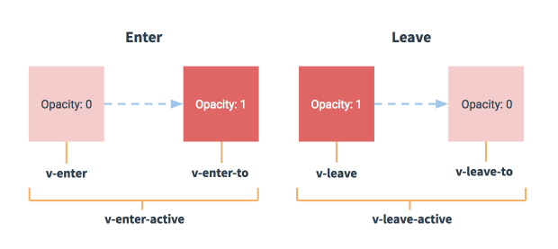

# 网站的交互

###    经典的多页面

​      以服务端为主导，前后端混合

​         例如：京东商城、唯品会     

​     1、用户体验一般，点击刷新跳转等待时间过长

​     2、每个页面都需要重新加载渲染，速度慢

​     3、有利于SEO搜索引擎搜索

​     4、前后端糅合在一起，开发和维护低下

 

###    现代的单页面应用程序(SPA)

​     例如：网易云音乐、coding

​     最主要的为了让你的前后端分离，前后端分离，各司其职，用户体验是其次的

​     1、用户体验好，就是一个原生的客户端软件一样使用

​     2、只需要加载渲染局部视图即可，不需要整页刷新

​     3、单页面应用开发技术复杂，所有诞生了一堆开发框架

​            \-  Angular.js

​            \-  React.js

​            \-  Vue.js

​     4、无法兼容低版本浏览器

​     5、单页面由于数据都是异步加载过来的，所以不会被搜索引擎搜到，不利于SEO

​     6、开发方式好，前后端分离，开发效率高，维护性好

​           \* 服务端不关系页面，只关系数据

​           \* 客户端不关系数据库操作，只关心通过接口拿数据和服务端交互


# 什么是Vue.js

​      提高开发效率的发展历程：原生JS  ->  Jquery之类的类库  ->  前端模板引擎  ->  Angular.js / Vue.js（能够帮助我们减少不必要的DOM操作；提高渲染效率；双向数据绑定的概念）

​      在Vue中，一个核心的概念，就是让用户不再操作DOM元素，解放了用户的双手，让程序员可以更多的时间去关注业务逻辑；

​     Vue核心思想：数据驱动视图

```
    new Vue({
        el: “#app”,      //不要作用到body、html节点上
        data: {          //响应式数据:数据驱动视图 
           msg: “hello word”         
        },
        Methods: {      //这里的方法不要使用箭头函数，否则绑定的是window

        } 
    }) 
```

​       

# Vue的特点

###    **MVVM**

​         Model - View - ViewModel

​              Model            数据模型

​              View               视图，将数据模型转化为视图展现出来

​              ViewModel   监听模型数据的改变和控制视图行为、处理用户交互

### **双向数据绑定**

​       两个方向：  

​             1、 将 Model(模型) 转化为 View(视图) ，即将后端传递的数据转化成所看到的页面，实现方式：数据绑定

​             2、 将 View(视图) 转化为 Model(模型)，即将所看到的页面转化成后端的数据，实现方式：DOM事件监听

​       在MVVM的框架下视图和模型是不能直接通信的。它们通过ViewModel来通信，ViewModel通常要实现一个observer观察者，当数据发生变化，ViewModel能够监听到数据的这种变化，然后通知到对应的视图做自动更新，而当用户操作视图，ViewModel也能监听到视图的变化，然后通知数据做改动，这实际上就实现了数据的双向绑定。并且MVVM中的View 和 ViewModel可以互相通信。MVVM流程图如下：

​         

###   **组件化**

​         \* 开发效率高

​        \* 可维护性好

​        \* 可重复使用

```
    <my-component></my-component>

        Vue.component(‘my-component’, {
       template: ‘<div>my Component</div>’
    })
```

​     一个应用被一个跟组件(app.vue)管理起来

​     组件一般分为两种

​      \* 通用组件    如：轮播图等

​      \* 业务组件    不通用，且尽量设计成局部的，不污染全局

###   **渐进式**


# 指令

## v-bind

```
<!-- 绑定一个有属性的对象 -->
<div v-bind="{ id: someProp, 'other-attr': otherProp }"></div>

<!-- 通过 prop 修饰符绑定 DOM 属性 -->
<div v-bind:text-content.prop="text"></div>

<!-- prop 绑定。“prop”必须在 my-component 中声明。-->
<my-component :prop="someThing"></my-component>

<!-- 通过 $props 将父组件的 props 一起传给子组件 -->
<child-component v-bind="$props"></child-component>

.camel 修饰符允许在使用 DOM 模板时将 v-bind 属性名称驼峰化，例如 SVG 的 viewBox 属性：
<svg :view-box.camel="viewBox"></svg>
注：在使用字符串模板或通过 vue-loader/vueify 编译时，无需使用 .camel
```

###  v-bind: class

```
1、 <div :class="{ active: isActive }"></div>
           active 这个 class 存在与否将取决于 isActive 的存在与否
           
    <div :class="{ active: currentIndex === index }"> 

2、 :class 指令也可以与普通的 class 属性共存
    <div class="static" :class="{ active: isActive, 'text-danger': hasError }"></div>
    
3、 * <div :class="{ active: isActive, 'text-danger': hasError }"></div>

    * <div v-bind:class="classObject"></div>
        data: {
           classObject: {
              active: true,
              'text-danger': false
           }
        }
    上面两种写法相同   
    
4、 绑定计算属性
    <div v-bind:class="classObject"></div>
    
    data: {
       isActive: true,
       error: null
    },
    computed: {
       classObject:  function () {
          return {
             active: this.isActive && !this.error,
             'text-danger': this.error && this.error.type === 'fatal'
          }
       } 
    }
    
5、 数组语法
    <div v-bind:class="[ activeClass,  errorClass ]"></div>

    data: {
      activeClass: 'active',
      errorClass: 'text-danger'
    }  
    
6、 三元表达式
    <div :class=" [ isActive ? activeClass : ' ' ,  errorClass ] "></div>
    
7、 在数组语法中也可以使用对象语法
    <div :class=" [ { active: isActive }, errorClass ] "></div>
    
8、 组件上使用 class 属性
    <p class="foo bar">Hi</p>
    
    <my-component class="baz boo"></my-component>
       渲染后为：<p class="foo bar baz boo">Hi</p>
       
    <my-component  :class="{ active: isActive }"></my-component>
    当 isActive 为 truthy[1] 时，HTML 将被渲染成为：<p class="foo bar active">Hi</p>
```

###  v-bind: style

```
1、<div :style=”{ color: activeColor, fontSize: fontSize + 'px' }”></div> 
   data: { active: ‘red’, fontSize: 30 }

2、<div :style=”styleObject”></div>
   data: {  styleObject: { color: ‘red’, fontSize: ‘18px’ }  }

3、<div :style=”[ baseStyle, overridingStyle ]”></div>
   data: {
      baseStyle: { color: ‘blue’, fontSize: ‘16px’ }  
      overridingStyle : { width: ‘300px’, backgroundColor: ‘red’ }   
   }
```

##  v-model

 作用： 双向绑定表单控件

```
只在  <input>  <select>  <textarea>  components（组件） 上使用
```

 修饰符：

​     .lazy     取代 input 监听 change 事件

​     .number    输入字符串转为有效的数字

​     .trim     输入首尾空格过滤

```
<input type=”text” v-model=”msg”>
实际是  <input type=”text” v-bind:value=”msg” v-on:input=”msg = #event.target.value”>
```

##  v-text

  更新元素的 textContent。如果要更新部分的 textContent ，需要使用 {{ Mustache }} 插值。   默认v-text没有闪烁的问题

```
<span v-text="msg"></span>
<!-- 和下面的一样 -->
<span>{{msg}}</span>
```

##  v-html

  更新元素的 innerHTML

```
<div v-html="html"></div>
```

  注意：内容按普通 HTML 插入 - 不会作为 Vue 模板进行编译 。如果试图使用 v-html 组合模板，可以重新考虑是否通过使用组件来替代。

## v-pre

   跳过这个元素和它的子元素的编译过程。可以用来显示原始 Mustache 标签。跳过大量没有指令的节点会加快编译。

```
<span v-pre> {{ this will not be compiled }} </span>
```

## v-cloak

   这个指令保持在元素上直到关联实例结束编译

   和 CSS 规则如 [v-cloak] { display: none } 一起用时，这个指令可以隐藏未编译的 Mustache 标签直到实例准备完毕，再显示插值

```
[v-cloak] {
  display: none;
}

<div v-cloak>
  {{ message }}
</div>
```

  使用v-cloak能解决插值表达式闪烁的问题

## v-once

​    只渲染元素和组件一次。随后的重新渲染，元素/组件及其所有的子节点将被视为静态内容并跳过。这可以用于优化更新性能。

```
<!-- 单个元素 -->
<span v-once> This will never change: {{ msg }} </span>

<!-- 有子元素 -->
<div v-once>
  <h1> comment </h1>
  <p>{ {msg }}</p>
</div>

<!-- 组件 -->
<my-component  v-once :comment="msg"></my-component>

<!-- `v-for` 指令-->
<ul>
  <li v-for="i in list" v-once>{{ i }}</li>
</ul>
```

组件 -  对低开销的静态组件使用 v-once

## 条件渲染

###  v-if  v-else  v-else-if

  根据表达式的值的真假条件编译、渲染元素。如果为false，则什么也不编译，不渲染。

  在切换时元素及它的数据绑定 / 组件被销毁并重建。如果元素是 <template> ，将提出它的内容作为条件块。

###  v-show

  根据表达式之真假值，切换元素的 display CSS 属性

  当条件变化时该指令触发过渡效果

## 列表渲染

###   v-for

​     预期:   Array | Object | number | string

​       可以为数组索引指定别名 (或者用于对象的键):

       <div v-for="(item, index) in items"></div>
       <div v-for="(val, key) in object"></div>
       <div v-for="(val, key, index) in object"></div>
## 事件绑定

###  v-on

​       预期： Function | Inline Statement | Object

​       参数： event

​       修饰符:

​        .stop           调用 event.stopPropagation()。

​       .prevent        调用 event.preventDefault()。

​      .capture        添加事件侦听器时使用 capture 模式。

​      .self           只当事件是从侦听器绑定的元素本身触发时才触发回调。

​      .{keyCode | keyAlias}   只当事件是从特定键触发时才触发回调。

​      .native         监听组件根元素的原生事件。

​      .once           只触发一次回调。

​      .left - (2.2.0)      只当点击鼠标左键时触发。

​      .right - (2.2.0)     只当点击鼠标右键时触发。

​      .middle - (2.2.0)    只当点击鼠标中键时触发。

​      .passive - (2.3.0)    以 { passive: true } 模式添加侦听器

```
    <!-- 停止冒泡 -->
    <button @click.stop="doThis"></button>

    <!-- 阻止默认行为 -->
    <button @click.prevent="doThis"></button>

    <!-- 阻止默认行为，没有表达式 -->
    <form @submit.prevent></form>

    <!--  串联修饰符 -->
    <button @click.stop.prevent="doThis"></button>

    <!-- 键修饰符，键别名 -->
    <input @keyup.enter="onEnter">

    <!-- 键修饰符，键代码 -->
    <input @keyup.13="onEnter">

    <!-- 点击回调只会触发一次 -->
    <button v-on:click.once="doThis"></button>

    <!-- 对象语法 (2.4.0+) -->
    <button v-on="{ mousedown: doThis, mouseup: doThat }"></button>
```

# 计算属性

###   computed: { }

​     一种带有行为的属性，本质是方法，但必须当属性来用

​    特点： 1、相比方法的优势在于会缓存计算的结果，相比methods效率很高

​                 2、可以把复杂的逻辑封装起来，每使用一次就调用一次

​                 3、不让模板逻辑太重

​                 4、解决性能问题

```
  计算属性的get方法
     computed: { 
        remaingCount: {
           // 当访问remaingCount 时会自动调用get方法  ( app.remaingCount )
           get() {
               return this.todos.filter( t => !t.completed ).length;
           },
           // 当remaingCount = xxx (赋值)的时候会自动调用set方法 ( app.remaingCount = 123    // ko )
           表单控件checked双向绑定remaingCount，当checked的变化会调用set 方法
           set() {
               console.log(‘ko’);
           }
        }
     }
```

# 监视

###     watch: { }

​         默认情况下对引用类型只监听一层，无法监视内部成员的子成员的改变

​        需要深度监听时，如下方式：

```
    watch: {
       todos: {
          handler() {
            console.log(‘todos 发生改变了’);
          },
          deep: true    // 深度监视，只有这样才能监视到数组或者对象孩子...孩子...成员的改变
                      // immediate: true   // 无论变化与否，上来就调用一次
       }
    }
```

# 自定义指令

   当不可避免的**需要对普通 DOM 元素进行底层操作**，这时候就会用到自定义指令

   注册自定义指令

​     1、 全局自定义指令

​     2、 局部自定义指令

   不使用Vue时，使用html5提供的autofocus（当页面加载时 input 元素会自动获得焦点） 没有问题

   但使用Vue之后，autofocus就无效了, 就需要自定义指令

```
//注册一个全局自定义指令 "v-focus"
Vue.directive('focus', {
  // 当被绑定的元素插入到 DOM 中时……
  inserted: function (el) {
    // 聚焦元素
    el.focus()
  }
})

  directive的第一个参数：为自定义指令的命名, 不支持驼峰命名，需要改为横杠- 
            第二个参数：为需要配置指令的生命钩子函数， 如bind、inserted、update、   componentUpdated、unbind   
            
          bind、inserted 都会先自动执行一次，bind先，inserted随后
                  bind  拿不到父元素
                  inserted  可以拿到父元素
                   要操作父元素要写到这个inserted中
                   input等输入框获得焦点（el.focus()）不能写在bind中，而因可以写在inserted中
                 注意：都只执行一次，以后不会再调用

          update、componentUpdated
             在该指令所处的模板及该指令所处之外被Vue管辖的模板发生变化时才会触发调用
             区别： 获取指令所在DOM的内容时，update获取的是模板更新之前的DOM的内容
                    componentUpdated 获取的是更新之后的最新DOM内容

          unbind  只调用一次，指令与元素解绑时调用
                可以做一些收尾工作，如清除定时器

     每个钩子函数有两个参数：
         el        指令所绑定的元素，可以用来直接操作 DOM 
         binding     一个对象，可以获取指令的值等信息
```


```
 //如果想注册局部指令，组件中也接受一个 directives 的选项：
 directives: {
   focus: {
     // 指令的定义
     inserted: function (el) {
       el.focus()
     }
   }
 }
 
 //然后你可以在模板中任何元素上使用新的 v-focus 属性，如下：
   <input type=”text” v-focus>
```

##  模拟v-bind 实现

```javascript
<div v-my-bind:title="msg"></div>

Vue.directive("my-bind", function() {
    bind(el, binding) {
        el.setAttribute(binding.arg, binding.value);     // binding.arg = title
    },
    update(el, binding) {
        el.setAttribute(binding.arg, binding.value);
    }
})
```

  若要在 bind 和 update 时触发相同行为，而不关心其它的钩子。则这样简写:

```javascript
    Vue.directive("my-bind", function(el, binding) {
        el.setAttribute(binding.arg, binding.value);  
    })
```

##  模拟v-show 实现

```javascript
<div v-my-show='seen'></div>

Vue.directive("my-show", {
    bind(el, binding) {
        if(binding.value) {
            el.style.display = "block";
        } else {
            el.style.display = "none";
        }
    },
    update(el, binding) {
        if(binding.value) {
            el.style.display = "block";
        } else {
            el.style.display = "none";
        }
    }
})
```

  简写:

```javascript
    Vue.directive("my-show", function(el, binding) {
        if(binding.value) {
            el.style.display = "block";
        } else {
            el.style.display = "none";
        }
    })
```

##  模拟v-bind:class = "{ }"

```javascript
<div v-my-bind:class="{ active: isActive }"></div>

Vue.directive("my-bind", function(el, binding) {
    if(binding.arg === "class") {
        for (let key in binding.value) {
            if (binding.value[key]) {
                el.classList.add(key);
            } else {
                el.classList.remove(key);
            }
        }
    } else {
        el.setAttribute(binding.arg, binding.value);
    }
})
```

## 对象字面量

​         如果指令需要多个值，可以传入一个 JavaScript 对象字面量。记住，指令函数能够接受所有合法的 JavaScript 表达式。

```
<div v-demo="{ color: 'white', text: 'hello!' }"></div>

Vue.directive('demo', function (el, binding) {
    console.log(binding.value.color)    //  "white"
    console.log(binding.value.text)     //  "hello!"
})
```

## 自定义指令可以传值

```
<input type="text" v-todo-focus="currentEditing === item">

Vue.directive("todo-focus", function () {
    update (el, binding) {
        //console.log(binding.value);  // currentEditing === item 的结果: true / false
        if (binding.value) {
            el.focus();
        }
    }
})
```


# 组件通讯

##  父子组件通讯

####     父 ----> 子 ： Props Down

​       子组件不关心父组件的业务

​       props是单向绑定的，每次父组件更新时，子组件的所有prop都会跟新为最新值

```
    在两种情况下，我们很容易忍不住想去修改 prop 中数据：
        1、Prop 作为初始值传入后，子组件想把它当作局部数据来用
        2、Prop 作为原始数据传入，由子组件处理成其它数据输出
        
        对这两种情况，正确的应对方式是：
        1. 定义一个局部变量，并用 prop 的值初始化它：
        props: ['initialCounter'],
        data: function () {
          return { counter: this.initialCounter }
        }
        
        2. 定义一个计算属性，处理 prop 的值并返回：
        props: ['size'],
        computed: {
          normalizedSize: function () {
            return this.size.trim().toLowerCase()
          }
        }
```

   注意：在 JavaScript 中对象和数组是引用类型，指向同一个内存空间，如果 prop 是一个对象或数组，在子组件内部改变它会影响父组件的状态。

​     父组件传到子组件的任何类型数据都不能在子组件中赋值，但可以对引用类型进行修改，如对数组添加元素push等，但不推荐这样直接对父组件传来的值进行修改

####  子组件接收父组件的方式props

```
   1、  props: [ 'postTitle' ]
        props: [ 'title' ,  'likes' ,  'isPublished' ,  'commentIds' ,  'author' ]

   2、  props: {
            title: String,
            likes: Number,
            isPublished: Boolean,
            commentIds: Array,
            author: Object
        }

    3、 props: {
            propA: Number,
            propB: [String, Number],
            propC: {
               type: String,
               required: true
            },
            propD: {
               type: Number,
               default: 100
            },    
            propE: {
               type: Object,
               default: function () {
                  return { message: 'hello' }
               }
            }
```

####   子 ------> 父 ： Events Up

​      自定义事件系统

​      步骤：

​        1. 在子组件中调用 $emit() 方法发布一个事件

​        2. 在父组件中提供一个子组件内部发布的事件处理函数

​        3. 在使用子组件的模板的标签上订阅子组件内部发布的事件

####   非父子组件通信  Event Bus

​       在简单的场景下，可以使用一个空的 Vue 实例作为事件总线

```
   var bus = new Vue();
   
   // 触发组件 A 中的事件
   bus.$emit('id-selected', 1);
  
   // 在组件 B 创建的钩子中监听事件
   bus.$on('id-selected', function (id) {
      // ...
   });
```

####    专业组件通信大杀器：Vuex

​         在复杂的情况下，我们应该考虑使用专门的 状态管理模式

# Vue.set( target, key, value )

​      向响应式对象中添加一个属性，并确保这个新属性同样是响应式的，且触发视图更新。它必须用于向响应式对象上添加新属性，因为 Vue 无法探测普通的新增属性 

# nextTick

  在下次 DOM 更新循环结束之后执行延迟回调。在修改数据之后立即使用这个方法，获取更新后的 DOM

​     在 .vue后缀的文件中使用方式：   this.$nextTick

```
    // 修改数据
    vm.msg = 'Hello'
    // DOM 还没有更新
    
    Vue.nextTick(function () {
      // DOM 更新了
    })
```

​     在created钩子函数中进行的DOM操作一定要放在Vue.nextTick() 的回调函数中

​           在created函数执行时DOM还未渲染，此时操作DOM没任何效果，所以要放在Vue.nextTick()的回调函数中，以之对应的就是mounted钩子函数

​          mounted函数执行时所有的DOM都挂载和渲染完成，此时进行DOM操作不会有问题


# 路由 

   **vue-router**

   使用 **router-link** 组件来导航，通过传入 **`to` 属性**指定链接

   **router-link** 默认会被渲染成一个 **`<a>` 标签**

```
 <router-link to="/foo"> Go to Foo </router-link>
 <router-link to="/bar"> Go to bar </router-link>
```

  **路由出口**，路由匹配到的组件将渲染在这里

```
 <router-view></router-view>
```

  如果使用模块化机制编程，导入Vue和VueRouter，要调用 Vue.use(VueRouter)

 1、**定义 (路由) 组件**   // 可以从其他文件 import 进来

```
const Foo = { template: "<div>foo</div>" }
const Bar = { template: "<div>bar</div>" }
```

 2、**定义路由**

  每个路由应该映射一个组件。 其中"component" 可以是通过 Vue.extend() 创建的组件构造器，或者，只是一个组件配置对象。

```
const routes = [
    { path: '/foo', component: Foo },
    { path: '/bar', component: Bar }
]
```

**3、创建 router 实例，然后传 `routes` 配置**

  你还可以传别的配置参数。

```
const router = new VueRouter({
    routes        // (缩写) 相当于 routes: routes
})  
```

 4、**创建和挂载根实例**

​    记得要通过 router 配置参数注入路由，从而让整个应用都有路由功能

```
const app = new Vue({router}).$mount('#app')
```

  通过注入路由器，我们可以在任何组件内通过 this.$router 访问路由器，也可以通过 this.$route 访问当前路由

```
this.$route.params.username
this.$router.go(-1)
this.$router.push('/')
```

##  路由跳转

###   声明式

```
1、 <template>
       <router-link to='/about>
    <template>
    // 路由配置  
    {
        path: "/about",
        component: About
    }

2、 <template>
      <router-link to= " { name: 'about' } ">
    <template>
    // 路由配置  
    {
        path: "/about",
        name: "about"   //必须项，对应上面的name
        component: About
    }
```

###   编程式

```
    <template>
      <div @click="toAbout">  go to about </div>
    <template>
    
   1、methods: {
        toAbout() {
           this.$router.push({
               path: "/about"
           })       
        }
      }  
      
   2、methods: {
        toAbout() {
            this.$router.push({
                 name: "about"
            })       
        }
      }
```

##  路由传参

###   声明式

```
    1、 <template>
           <router-link to="/about/123"> go to about  </router-link>
        </template>

        // 路由配置  
        {
           path: "/about/:aid",    //动态路由
           component: About
        }

        // about.vue中获取动态路由
        this.$route.params;  
        this.$route.params.aid;  // 123 

    2、 <template>
           <router-link to="/about?id=123"> go to about  </router-link>
        </template>

        // 路由配置  
        {
            path: "/about",    
            component: About
        }

        // about.vue中获取动态路由
        this.$route.query.id;   // 123 

      3、 <template>
             <router-link :to=" { name: 'about', query: { id: 123, name: 'boy' } } “>  
                 go to about  
             </router-link>
         </template>

         // 路由配置  
         {
            path: "/about",    
            name: "about",     //必须项
            component: About
         }

         // about.vue中获取动态路由
         this.$route.query.id;   // 123 
         this.$route.query.name;   // boy
```

###   编程式

```
     <template>
        <div @click="toAbout">  go to about </div>
     <template>
     
 1、 methods: {
        toAbout() {
            this.$router.push({ 
                path: ‘/about’,     
                //用query传递参数时，可以用path和name的方式跳转
                query: { id: 223, name: ’boy‘ }
            })
        }
     } 
     // 路由配置  
     {
        path: "/about",    
        name: "about",     
        component: About
     }
     // about.vue中获取动态路由
     this.$route.query.id;   // 223 
     this.$route.query.name;   // boy
     
 2、 methods: {
        toAbout() {
            this.$router.push({ 
                name: 'about',     //用params传参时，跳转必须用name的方式
                params: { id: 223, name: 'boy' }
            })
        }
    }
    // 路由配置  
    {
        path: "/about",    
        name: "about",     //必须项
        component: About
    }
    // about.vue中获取动态路由
    this.$route.params.id;   // 223 
    this.$route.params.name;   // boy
```


# ref

  预期：string

   ref 被用来给元素或子组件注册引用信息。引用信息将会注册在父组件的 $refs对象上。如果在普通的 DOM 元素上使用，引用指向的就是 DOM 元素；如果用在子组件上，引用就指向组件实例：

```
<!-- vm.$refs.p -->
<p ref="p">hello</p>

<!-- vm.$refs.child  -->
<child-component ref="child"></child-component>
```

​    在mounted函数中使用$refs获取不到有v-if、v-show、v-for的DOM节点，因这些响应式的DOM还没渲染，所有$refs返回的是undefined

# is

   预期：string | Object (组件的选项对象)

   用于动态组件且基于DOM-模板解析说明来工作

```
<!-- 当 currentView 改变时，组件也跟着改变 -->
<component  v-bind:is="currentView"></component>

<!-- 这样做是有必要的，因为 <my-row> 放在一个 <table> 内可能无效且被放置到外面-->
<table>
  <tr is="my-row"></tr>
</table>
```

# Vue过渡

 在进入/离开的过渡中，会有 6 个 class 切换

  1、v-enter：定义进入过渡的开始状态。在元素被插入之前生效，在元素被插入之后的下一帧移除。

  2、v-enter-active：定义进入过渡生效时的状态。在整个进入过渡的阶段中应用，在元素被插入之前生效，在过渡/动画完成之后移除。这个类可以被用来定义进入过渡的过程时间，延迟和曲线函数。

  3、v-enter-to:  定义进入过渡的结束状态。在元素被插入之后下一帧生效 (与此同时 v-enter 被移除)，在过渡/动画完成之后移除。

  4、v-leave: 定义离开过渡的开始状态。在离开过渡被触发时立刻生效，下一帧被移除。

  5、v-leave-active：定义离开过渡生效时的状态。在整个离开过渡的阶段中应用，在离开过渡被触发时立刻生效，在过渡/动画完成之后移除。这个类可以被用来定义离开过渡的过程时间，延迟和曲线函数。

  6、v-leave-to:   定义离开过渡的结束状态。在离开过渡被触发之后下一帧生效 (与此同时 v-leave 被删除)，在过渡/动画完成之后移除。

   

# Axios

1、下好axios后引入

```
import Axios from "axios";
Vue.prototype.$axios = Axios;   //挂载全局
Axios.defaults.baseURL = 'https://a.itying.com/’;    // 设置好部分url
```

2、使用

## get请求

```
1、 this.$axios.get("api/productcontent”)   // https://a.itying.com/api/productcontent
    .then( res => {
       console.log(res.data);
    })
    .catch( error => {
       console.log(error);
    });


2、 this.$axios.get("api/productcontent”, {
       params: {
          ID: 12345
       }
    })
    .then(function (response) {
       console.log(response);
    })
    .catch(function (error) {
       console.log(error);
    });
```

## post请求

```
  this.$axios.post('/user', {
     firstName: 'Fred',
     lastName: 'Flintstone'
  })
  .then(function (response) {
     console.log(response);
  })
  .catch(function (error) {
     console.log(error);
  });
```

## 执行多个并发请求

```
function getUserAccount() {
     return this.$axios.get('/user/12345');
}
function getUserPermissions() {
     return axios.get('/user/12345/permissions');
}
this.$axios.all( [ getUserAccount(), getUserPermissions() ] )
 .then(axios.spread(function (acct, perms) {
      // 两个请求现在都执行完成
 }));
```

